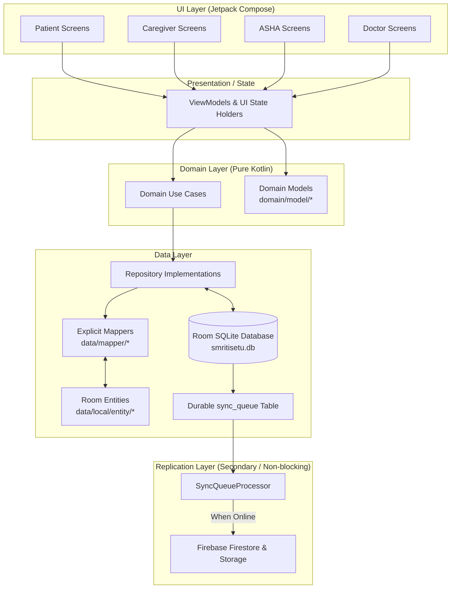
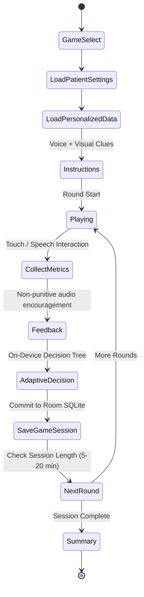

# SmritiSetu (SIH-26003) — Authoritative Technical Architecture

> **Platform**: 100% Native Android (Kotlin + Jetpack Compose)  
> **Core Architectural Principle**: **"ROOM IS KING. FIREBASE IS THE MESSENGER."**  
> **Pattern**: Feature-First + Lightweight Clean Architecture (Pragmatic, Offline-First, Zero Overengineering)

---

## 🏛️ 1. System Overview & Clean Separation

SmritiSetu is architected to guarantee total offline autonomy for rural North Eastern India while maintaining clear boundaries across UI, domain logic, local persistence, and background replication.



---

## 🚫 2. Resolving the Duplicate Model Problem

To completely eliminate ambiguity between persistence entities and presentation models, the codebase strictly enforces:

1. **`data/local/entity/`**:
   - Contains Room-annotated SQLite tables (e.g., `PatientEntity`, `GameSessionEntity`, `ReminderEntity`, `CareLogEntity`).
   - Represents raw database schema, foreign keys, and indices.
   - **RULE**: Room entities are strictly internal to the `data/` layer. They must **NEVER** be imported into `feature/`, UI composables, or ViewModels.

2. **`domain/model/`**:
   - Contains pure, immutable Kotlin data classes (e.g., `Patient`, `GameSession`, `Reminder`, `CareLog`).
   - Completely free of Android, Room, or Firebase annotations.
   - Used across ViewModels, UI Composables, and Domain Use Cases.

3. **`data/mapper/`**:
   - Contains explicit Kotlin extension functions:
     ```kotlin
     fun PatientEntity.toDomain(): Patient
     fun Patient.toEntity(): PatientEntity
     fun GameSessionEntity.toDomain(): GameSession
     fun GameSession.toEntity(): GameSessionEntity
     ```
   - Encapsulates JSON conversions, default values, and legacy migration fallbacks.

---

## 👥 3. Four Distinct User Roles

```
┌─────────────────────────────────────────────────────────────────────────────┐
│                              SMRITISETU USERS                               │
├───────────────────┬───────────────────┬───────────────────┬─────────────────┤
│      PATIENT      │     CAREGIVER     │       ASHA        │     DOCTOR      │
├───────────────────┼───────────────────┼───────────────────┼─────────────────┤
│ • Zero PIN        │ • Local 6-digit   │ • Shared-device   │ • Local PIN +   │
│   (Photo tap)     │   PIN             │   multi-patient   │   Doctor Access │
│ • 6 Cognitive     │ • Patient profile │ • Patient switch  │   Code          │
│   Games           │ • Today's Priority│ • Quick Field Log │ • My Patients   │
│ • Memory Album    │ • Quick Log (<30s)│ • Flag review     │ • 7/30/90 Day   │
│ • Offline Voice   │ • Reminders       │ • Batch offline   │   Trends        │
│ • Offline Alarms  │ • Memory Album    │   synchronization │ • Neutral Flags │
│ • SOS Help Button │ • Emergency / SOS │ • Caregiver alert │ • 1-Page PDF    │
│ • No Analytics    │ • Doctor Access   │   handover        │ • Zero Medical  │
│                   │   Code generation │                   │   Diagnosis     │
└───────────────────┴───────────────────┴───────────────────┴─────────────────┘
```

> [!IMPORTANT]
> **ASHA Workflows are NOT Caregiver Screens**: ASHA workers visit multiple elderly households in rural villages using a single tablet or phone. The ASHA module explicitly provides **Patient Switching**, **Batch Offline Logging**, and **Community Observation Registers** without requiring personal family access.

---

## 🎮 4. Unified Six-Game Framework

All six games inherit from the unified `CommonGameFramework`:



### Standardized Game Engine Contracts:
* `GameDefinition`: Metadata, clinical domain, supported difficulty levels (1–5).
* `GameState`: Reactive state containing current round, timer, active stimuli, distractors, and score.
* `GameAction`: User inputs (`TapOption`, `DragItem`, `VoiceResponseReceived`, `Timeout`).
* `GameResult`: Round outcome (`isCorrect`, `reactionTimeMs`, `hesitationGaps`, `errorCount`).
* `GameSession`: Domain model written to Room capturing duration, accuracy, and adaptation recommendation.
* `GameTelemetry`: Real-time touch coordinates, tap latency, and pauses.

### The Six Games:
1. **Family Trivia** (`পৰিয়ালৰ স্মৃতি`): Memory & Identity — photo and relationship recognition from Room.
2. **Voice Cue Card** (`কণ্ঠ আৰু ছবি`): Attention & Recall — spoken audio prompts with 5-second voice fallback and touch cards.
3. **Daily Sequencing** (`দৈনন্দিন ক্ৰম`): Executive Function — chronological steps of daily routines (Assam tea, morning Namghar routine) with distractors.
4. **Categorisation** (`শ্ৰেণীবিভাজন`): Categorical Thinking — grouping fruits, vegetables, animals, and traditional textiles.
5. **Village Market** (`গাঁওৰ বজাৰ`): Working Memory — shopping list recall with authentic regional items (Joha rice, Kaji nemu).
6. **Pattern / Object Matching + Mental Rotation** (`আৰ্হি চিনাক্তকৰণ`): Visuospatial Processing — high-contrast geometric motifs and rotated cultural symbols.

---

## 🧠 5. Explainable On-Device Engines

### A. Adaptive Difficulty Engine (`engine/adaptive/`)
* **Technology**: Scikit-learn Decision Tree trained in Python (`scripts/train_decision_tree.py`) and exported to JSON (`assets/ml/decision_tree_difficulty.json`).
* **Runtime**: Kotlin recursive tree evaluator (`DecisionTreeEngine.kt`) running on CPU in $<1\text{ms}$.
* **Inputs**: Accuracy (0.0–1.0), Reaction Time (ms), Errors, Hesitation Gaps ($>3500\text{ms}$), Current Level (1–5).
* **Output**: Recommended Next Difficulty Level (1 to 5).
* **Clinical Safety**: Never diagnoses dementia; strictly labels output as *"Recommended next difficulty"*.

### B. Priority Engine (`engine/priority/`)
* **Technology**: Deterministic, rule-based clinical and care priority evaluator.
* **Priority Tiers**: `NORMAL` $\rightarrow$ `WATCH` $\rightarrow$ `PRIORITY` $\rightarrow$ `URGENT`.
* **Input Signals**:
  - Missed critical medication alarms ($>2$ instances).
  - Recent fall recorded in Caregiver/ASHA Quick Log.
  - Wandering incident or agitation flag.
  - Abrupt game participation drop ($>50\%$ decline over 7 days).
  - SOS emergency trigger event.
* **Output**: Top 3 actionable care recommendations for Caregiver and ASHA home screens.

---

## 🎨 6. Cultural Theme Engine (`cultural/`)

The Cultural Theme Engine personalizes games, objects, and visual assets according to the patient's cultural background, **independently of UI language**:

```
[Cultural Theme Pack: Assam / Manipur / Meghalaya]
       │
       ├── Foods:      Assam Tea, Pitha, Kaji Nemu vs Manipuri Chak-hao vs Khasi Rice
       ├── Objects:    Japi, Gamosa vs Radha-Krishna Pung, Meitei Pot vs Ryndia Shawl
       ├── Music:      Borgeet, Flute vs Pena Melodies vs Traditional Khasi Tunes
       └── Markets:    Bihu Village Haat vs Khwairamband Bazar vs Iewduh Market
```

* **Decoupled Architecture**: An Assamese patient who prefers English UI still experiences authentic Assam cultural items and motifs.

---

## 🔄 7. Offline-First Synchronization Architecture

SmritiSetu enforces a strict local-first write and read cycle:

```
[Compose UI] ──write──> [Repository] ──write──> [Room SQLite (smritisetu.db)]
                                                       │
                                            (Auto-enqueue trigger)
                                                       │
                                                       ▼
                                            [sync_queue Table]
                                                       │
                                         [SyncQueueProcessor (WorkManager)]
                                                       │
                                          (Detect Network via ConnectivityObserver)
                                                       │
                                                       ▼
                                             [Firebase Firestore]
```

### Core Sync Components:
* `SyncQueueItem`: Entity storing table name, record ID, operation (`INSERT`, `UPDATE`, `DELETE`), JSON payload, retry count, and sync state.
* `SyncManager`: Coordinates synchronization requests and exposes `SyncStatus` Flow (`IDLE`, `SYNCING`, `OFFLINE`, `ERROR`).
* `SyncWorker`: Android `CoroutineWorker` executing opportunistic synchronization in background.
* `ConnectivityObserver`: Android `ConnectivityManager` flow monitoring Wi-Fi and Cellular availability.
* **Offline Guarantee**: Data is never deleted locally after sync; zero network calls occur on the main gameplay thread.
