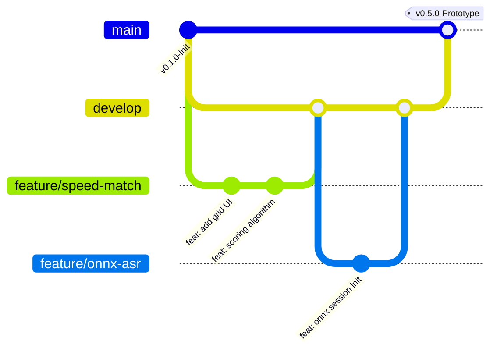

# SmritiSetu (SIH26003) — Engineering Contribution Guidelines

Welcome to the **SmritiSetu** core engineering team. This repository powers an offline-first cognitive healthcare platform for elderly dementia patients in North Eastern India under Smart India Hackathon 2025.

Because we have **6 engineers collaborating simultaneously across a tight 14-day delivery window**, strict adherence to these collaboration rules is mandatory to guarantee zero merge conflicts, 100% offline uptime, and full DPDA 2023 compliance.

---

## 👥 1. The 6-Member Team & Domain Ownership

Every team member has primary ownership over specific directories and subsystems. Cross-cutting modifications require explicit sign-off from the domain owner.

| Team Role | Git Handle Placeholder | Primary Owned Subsystem / Folders |
| :--- | :--- | :--- |
| **Member 1 (Architect / Lead)** | `@lead-architect` | System Architecture, Git workflows, Release builds, `SECURITY.md`, `.github/` |
| **Member 2 (Mobile 1 - Games)** | `@mobile-games` | `mobile-app/src/features/games/`, Canvas/Animations, Game audio prompts |
| **Member 3 (Mobile 2 - Core)** | `@mobile-core` | `mobile-app/src/database/`, `mobile-app/src/store/`, Accessibility, UI layout |
| **Member 4 (Edge AI / Speech)** | `@ai-edge` | `mobile-app/src/services/ai/`, ONNX Runtime Mobile, IndicConformer models |
| **Member 5 (Backend / Sync)** | `@backend-sync` | `backend/`, `infrastructure/`, PostgreSQL schema, Sync API contract |
| **Member 6 (UX / QA / Clinical)** | `@clinical-qa` | `mobile-app/src/assets/`, Cultural asset curation, WCAG testing, Clinical validation |

---

## 🌿 2. Branching Strategy: Trunk-Based Development with Short-Lived Feature Branches

Direct commits to `main` and `develop` are **strictly blocked by branch protection rules**.



### Branch Naming Conventions
All branch names must follow the format: `<type>/<issue-number>-<short-kebab-description>`

* `feat/` — New feature implementation (e.g., `feat/12-story-weaver-speech-recorder`)
* `fix/` — Bug fix (e.g., `fix/34-sqlite-wal-checkpoint-leak`)
* `refactor/` — Code improvement with no behavior change (e.g., `refactor/45-redux-patient-slice`)
* `docs/` — Documentation updates (e.g., `docs/08-accessibility-checklist-update`)
* `test/` — Unit, E2E, or integration test suites (e.g., `test/22-game-scoring-formula-tests`)
* `perf/` — Performance tuning (e.g., `perf/19-onnx-int8-inference-latency`)

---

## 📝 3. Conventional Commit Standard

Commit messages must strictly follow the [Conventional Commits v1.0.0](https://www.conventionalcommits.org/) specification. This automates semantic changelog generation and maintains a clean audit trail for hackathon evaluators.

### Commit Format:
```text
<type>(<scope>): <short imperative description in present tense>

[optional detailed explanation of why this change was made]

[optional issue reference, e.g., Closes #14]
```

### Allowed Types:
* `feat`: A new feature for the user or clinical caregiver
* `fix`: A bug fix in game logic, storage, or synchronization
* `perf`: Performance improvement (e.g., reducing ASR latency)
* `refactor`: Code change that neither fixes a bug nor adds a feature
* `style`: Formatting, missing semi-colons, white-space changes
* `test`: Adding or correcting tests
* `docs`: Documentation changes only
* `chore`: Build process, dependency updates, tooling configuration

### Allowed Scopes:
* `games` (`speed-match`, `story-weaver`, `picture-naming`)
* `database` (`sqlite`, `migrations`, `sqlcipher`)
* `sync` (`queue`, `backoff`, `network`)
* `ai` (`onnx`, `asr`, `conformer`)
* `ui` (`accessibility`, `fonts`, `high-contrast`)
* `caregiver` (`dashboard`, `alerts`, `profiles`)
* `backend` (`api`, `models`, `auth`)

### Good Example:
```text
feat(games/speed-match): implement ACTIVE clinical scoring formula

Calculates visual processing speed index incorporating response time
decay and error penalties according to the Ball et al. (2002) model.

Closes #15
```

### Bad Example (DO NOT DO THIS):
```text
fixed some stuff
updated code
asdf
wip game
```

---

## 🚀 4. Pull Request (PR) Quality Protocol

Every PR must satisfy the following checklist before being merged:

1. **Self-Review**: Run `npm run lint` and `npm test` locally before raising PR.
2. **Issue Linkage**: Every PR must reference an active GitHub Issue (`Fixes #123`).
3. **Reviewers**: At least **one peer review approval** is required.
   * Modifying `mobile-app/src/database/**` requires `@mobile-core` sign-off.
   * Modifying `mobile-app/src/services/ai/**` requires `@ai-edge` sign-off.
4. **CI Pipeline Pass**: The GitHub Actions CI check (`build-test-apk`) must be green.
5. **No Merge Commits**: Use **Squash and Merge** or **Rebase and Merge** to keep Git history linear and clean.

---

## 🧪 5. Testing & Verification Requirements

No code may be committed without verifiable local proof:

* **Unit Tests**: All pure business logic (clinical scoring formulas, Redux reducers, sync queue serialization) must have matching Jest unit tests in `__tests__/`.
* **Zero Connectivity Verification**: Any mobile feature change MUST be tested in **Airplane Mode** to verify zero network requests are attempted during core user interaction.
* **Audio Buffer Zeroing**: Any audio handling logic must verify that raw PCM buffers are released from memory immediately after inference.

---

## ⚠️ 6. Emergency Conflict Resolution Protocol

If two developers encounter a merge conflict:
1. **Never force-push (`git push -f`)** to `main` or `develop`.
2. Rebase your feature branch against the latest `develop`:
   ```bash
   git checkout develop
   git pull origin develop
   git checkout feature/your-feature-name
   git rebase develop
   ```
3. Resolve conflicts in your code editor, verify that `npm test` passes, then:
   ```bash
   git add <resolved-files>
   git rebase --continue
   git push origin feature/your-feature-name --force-with-lease
   ```
4. If the conflict involves the database schema (`src/database/schema.ts`), consult `@mobile-core` immediately before resolving.
