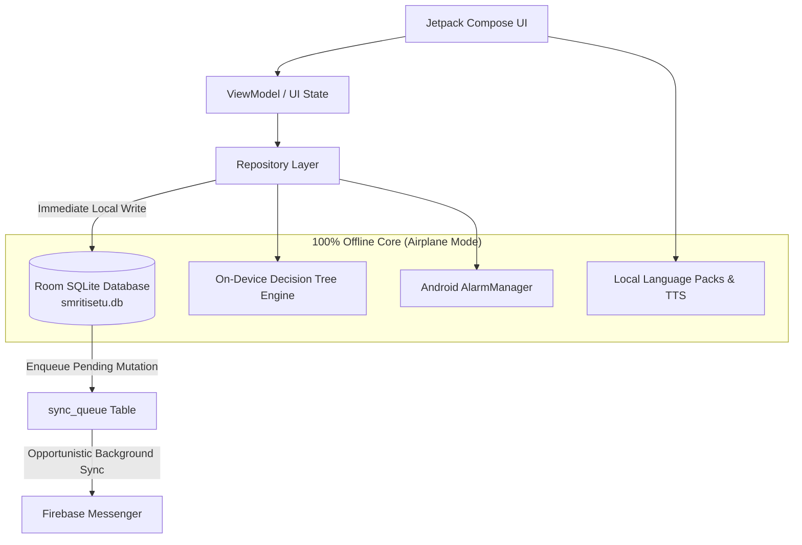

# SmritiSetu (SIH26003) — Master Implementation & Architecture Blueprint

**AI-Based Cognitive Gaming and Memory Assistance Platform for Elderly Dementia Patients in North Eastern Region (NER) of India**  
*Sponsoring Ministry*: Ministry of Development of North Eastern Region (MDoNER), Government of India.  
*Core Architectural Tenet*: **"ROOM IS KING. FIREBASE IS THE MESSENGER."**

---

## 🏛️ 1. Project Overview & SIH Problem Context

In rural North Eastern India (Assam, Manipur, Mizoram, Nagaland), elderly individuals facing Mild Cognitive Impairment (MCI) and early dementia encounter significant challenges: geographic isolation, intermittent 2G/zero internet connectivity, low digital literacy, and cultural alienation from generic Westernized cognitive assessments.

**SmritiSetu** resolves this challenge with an offline-autonomous Android native application providing:
1. **Culturally Grounded Cognitive Gaming**: Six native games reflecting authentic regional traditions (Assam tea preparation, Namghar routines, local village markets, high-contrast cultural motifs).
2. **On-Device Adaptive Difficulty**: Scikit-learn trained Decision Tree classifier evaluated locally in Kotlin in $<1\text{ms}$ with zero cloud dependencies.
3. **Local-First Caregiver & Clinician Bridge**: Autonomous local Room SQLite database as the single source of truth, backed by an opportunistic, non-blocking Firebase synchronization messenger.

---

## 🏗️ 2. Authoritative Architecture & Data Flow



### Architectural Principles:
* **Platform**: 100% Native Android (Kotlin + Jetpack Compose + Material 3).
* **Source of Truth**: Room Database (`smritisetu.db`) with SQLite engine. Every read and write originates locally.
* **Secondary Messenger**: Firebase is used exclusively for background backup and doctor sharing.
* **Zero OTP / SMS**: Caregivers and Doctors authenticate with local 6-digit PINs (SHA-256 in Room); Patients authenticate with **zero PIN** (direct photo card tap).
* **Ethical Boundary**: Measures physical reaction latency, accuracy, and hesitation gaps. Absolutely **NEVER** outputs a dementia diagnosis or clinical severity score.

---

## 🎮 3. The Six Native Cognitive Games

All six games inherit from the unified `BaseGameEngine` framework with non-punitive audio encouragement:

| # | Game | Clinical Focus | Cultural & Interaction Highlights | Adaptive Levels (1 to 5) | Status |
|---|---|---|---|---|:---:|
| **1** | **Family Trivia** (`পৰিয়ালৰ স্মৃতি`) | Memory & Identity | Personal family photos and relationships loaded from local Room database. | L1: Photo+Name (2 choices) $\rightarrow$ L2: Relationship prompt $\rightarrow$ L3: 4 choices $\rightarrow$ L4: Audio clue $\rightarrow$ L5: Direct recall. | **REAL** |
| **2** | **Voice Cue Card** (`কণ্ঠ আৰু ছবি`) | Attention & Recall | Spoken item audio prompts with large visual touch cards. | L1: Single item $\rightarrow$ L2: Short instruction $\rightarrow$ L3: 2-step cue $\rightarrow$ L4: Mixed list $\rightarrow$ L5: 3-item sequence. | **REAL** |
| **3** | **Daily Sequencing** (`দৈনন্দিন ক্ৰম`) | Executive Function | Familiar routines (making Assam milk tea, morning Namghar routine). | L1: 2 steps $\rightarrow$ L2: 3 steps $\rightarrow$ L3: 4 steps $\rightarrow$ L4: 4 steps + distractor $\rightarrow$ L5: 5–6 chronological steps. | **REAL** |
| **4** | **Categorisation** (`শ্ৰেণীবিভাজন`) | Categorical Thinking | Grouping items into fruits, vegetables, animals, and traditional wear. | L1: 2 obvious groups $\rightarrow$ L2: 3 groups $\rightarrow$ L3: Less obvious items $\rightarrow$ L4: 4 groups + distractors $\rightarrow$ L5: Multi-item sorting. | **REAL** |
| **5** | **Village Market** (`গাঁওৰ বজাৰ`) | Working Memory | Shopping list recall with authentic NER goods (Joha rice, Kaji nemu). | L1: 2 items $\rightarrow$ L2: 3 items $\rightarrow$ L3: 3–4 items + stall distractors $\rightarrow$ L4: 8-item market stall $\rightarrow$ L5: 5 items + delayed recall. | **REAL** |
| **6** | **Pattern Recognition** (`আৰ্হি চিনাক্তকৰণ`) | Visuospatial Speed | High-contrast visual sequences and cultural motifs. | L1: 2-item alternating $\rightarrow$ L2: 3-item repeating $\rightarrow$ L3: Step rhythm $\rightarrow$ L4: Complex + distractors $\rightarrow$ L5: Abstract sequence. | **REAL** |

---

## 🖼️ 4. Reminiscence & Sensory Experiences (Roadmap Phase 2)

Designed for calming, non-scored emotional and sensory stimulation:
* **Module 1: Memory Album**: Viewing high-contrast family photographs with spoken descriptions and voice recordings.
* **Module 2: Familiar Music / Audio**: Offline local player for traditional folk tunes, borgeet, and calming melodies with play/pause/repeat controls.
* **Module 3: Festival / Food Stories**: Conversational cultural prompts (Bihu festivals, traditional pitha/tea making).

---

## 👨‍👩‍👦 5. Caregiver & Clinician Systems

### Caregiver Experience:
* **Today's Priority Engine**: Deterministic logic presenting max 3 actionable priorities (missed medications, appointments, recent falls).
* **Quick Log**: Fast $<30\text{s}$ event logger for medication, appetite, sleep, falls, wandering, and agitation.
* **Weekly Overview**: Real SQLite adherence percentages and incident tallies with zero fake graphs.
* **Emergency Toolkit**: Emergency Call intent, Patient Missing card with photo and emergency contacts, Fall triage steps, and De-escalation guidance.
* **Caregiver Wellbeing**: Weekly stress check-in (Doing okay, Tired, Stressed, Overwhelmed).

### Clinician Experience:
* **Doctor Access**: 6-digit Doctor Access Code entry granting scoped, revocable access.
* **Longitudinal Review**: Physical interaction trends (latency, errors, hesitation) without automated diagnosis.
* **Explainable Referral Prompts**: Rule-based prompts (*"Consider clinical review"*) triggered if $>1$ fall or adherence $<60\%$.
* **1-Page PDF Export**: Local generation via Android `PdfDocument` stored in app-private storage without cloud dependencies.

---

## 👥 6. Six Equal Contributors & Work Allocation

All six team members are **equal contributors**. Everyone writes code, tests, and conducts peer reviews:

| Member | Feature Ownership Area | Designated Working Branch | Default Peer Reviewer |
| :--- | :--- | :--- | :--- |
| **Venkatesh** | Game Framework + Session/Metrics | `feature/venkatesh/game-framework` | Jasleen |
| **Jasleen** | Family Trivia + Personalization | `feature/jasleen/family-trivia` | Krishna |
| **Krishna** | Voice Cue Card + Voice Experience | `feature/krishna/voice-cue-card` | Shravani |
| **Shravani** | Reminders System (Medicine/Alarms) | `feature/shravani/reminders` | Bhavya |
| **Bhavya** | Accessibility + Patient UI Polish | `feature/bhavya/accessibility` | Kimaya |
| **Kimaya** | Sequencing + Categorisation Games | `feature/kimaya/sequencing-categorisation` | Venkatesh |

### 🔄 Review Rotation:
$$\text{Venkatesh} \rightarrow \text{Jasleen} \rightarrow \text{Krishna} \rightarrow \text{Shravani} \rightarrow \text{Bhavya} \rightarrow \text{Kimaya} \rightarrow \text{Venkatesh}$$
*Shared infrastructure PRs (Room schema, navigation, Gradle) require **TWO approvals**.*

---

## 🌿 7. Protected Branch Strategy & Contributor Workflow

> **NO DIRECT PUSHES TO `main` OR `develop`.**  
> All work occurs in `feature/<member>/<feature>` branches and merges into `develop` through Pull Requests and peer review.

```
[feature/<member>/<feature>] ──(PR + Review + CI)──> [develop] ──(Release Sign-off)──> [main]
```

### Contributor Lifecycle:
1. `git checkout develop && git pull origin develop`
2. `git checkout -b feature/<member>/<feature>`
3. Work with AI coding agent within your feature scope.
4. Run `git status` and `git diff` to verify only your module was touched.
5. Run `./gradlew testDebugUnitTest` and `./gradlew assembleDebug`.
6. Commit with conventional format (e.g. `feat(familytrivia): load patient relationships`).
7. Push: `git push -u origin feature/<member>/<feature>`.
8. Open Pull Request targeting `develop` using the PR template checklist.
9. Designated reviewer approves PR $\rightarrow$ GitHub Actions CI passes $\rightarrow$ Squash & Merge.

---

## 📂 8. Repository Layout

```text
SIH26003/
├── app/
│   ├── src/main/java/com/sih26003/smritisetu/
│   │   ├── feature/games/    # Common framework + 6 native games
│   │   ├── feature/auth/     # Local PIN & Patient photo select
│   │   ├── feature/patient/  # Large-target patient dashboard
│   │   ├── feature/caregiver/# Caregiver dashboard & doctor linking
│   │   ├── feature/doctor/   # Longitudinal game signal review
│   │   ├── feature/reminders/# Exact offline AlarmManager scheduling
│   │   ├── data/local/       # Room database (7 entities, 7 DAOs)
│   │   ├── data/firebase/    # Background sync queue messenger
│   │   ├── ml/               # On-device Decision Tree interpreter
│   │   └── voice/            # Voice prompts & language packs
│   ├── src/main/assets/      # Local ML tree JSON & language packs
│   └── src/test/java/        # Unit test suite
├── assets/                   # Master ML tree model & language packs
├── docs/                     # Authoritative Documentation
│   ├── LOCKED_ARCHITECTURE.md
│   ├── PS_COVERAGE_MATRIX.md
│   ├── IMPLEMENTATION_ROADMAP.md
│   ├── TEAM_WORKFLOW.md
│   ├── data-model/ROOM_SCHEMA.md
│   ├── games/SIX_GAMES_SPECIFICATION.md
│   └── testing/OFFLINE_VERIFICATION_CHECKLIST.md
├── gradle/                   # Gradle wrapper & libs.versions.toml
├── scripts/                  # train_decision_tree.py
├── .agents/                  # Antigravity project intelligence (rules, agents, workflows)
├── .github/                  # CODEOWNERS, PR template, CI workflow
├── .gitignore                # Android & OS ignore rules
├── CONTRIBUTING.md           # Developer workflow & AI safety contract
├── LICENSE                   # Open source license
├── build.gradle.kts          # Root build configuration
├── gradle.properties         # JVM & AndroidX properties
├── gradlew / gradlew.bat     # Gradle wrapper executables
└── settings.gradle.kts       # Module settings
```

---

## ⚡ 9. Build & Verification Commands

```bash
# 1. Generate & export Decision Tree model to JSON
python scripts/train_decision_tree.py

# 2. Build Android Debug APK
./gradlew assembleDebug

# 3. Execute unit tests
./gradlew testDebugUnitTest
```

---

## 🎬 10. Verified SIH Demonstration Flow

1. **Caregiver Login**: Opens app $\rightarrow$ Selects Caregiver $\rightarrow$ Enters 6-digit PIN.
2. **Patient Management**: Caregiver adds/selects patient profile (`AS-KAM-0042`).
3. **Personalization**: Caregiver adds family member (Name: *Rupam*, Relationship: *Son*).
4. **Patient Entry**: Logs out $\rightarrow$ Taps patient avatar card (Zero PIN).
5. **Game 1 (Family Trivia)**: Personalized question displays with family member from Room.
6. **Adaptive Difficulty**: Decision Tree adapts round difficulty (1–5) based on real physical latency.
7. **Offline Alarms**: Offline reminder triggers via native `AlarmManager`.
8. **Airplane Mode Verification**: Turn Airplane Mode ON $\rightarrow$ Play Games 2 to 6 $\rightarrow$ All operate smoothly with zero network.
9. **Doctor Access**: Doctor enters 6-digit access code $\rightarrow$ Views longitudinal signals and flags.

---

## ⚠️ 11. Known Limitations & Safety Guardrails

* **Non-Diagnostic Tool**: Evaluates physical gameplay metrics (reaction speed, accuracy, hesitation gaps). Does **NOT** diagnose dementia.
* **TTS Language Availability**: High-quality local TTS depends on system voice engines; pre-recorded JSON prompt packs provide reliable fallbacks for Assamese and English.
* **Speech Recognition**: Voice input is strictly optional; touch is always available to prevent blocking users with rural dialects.
