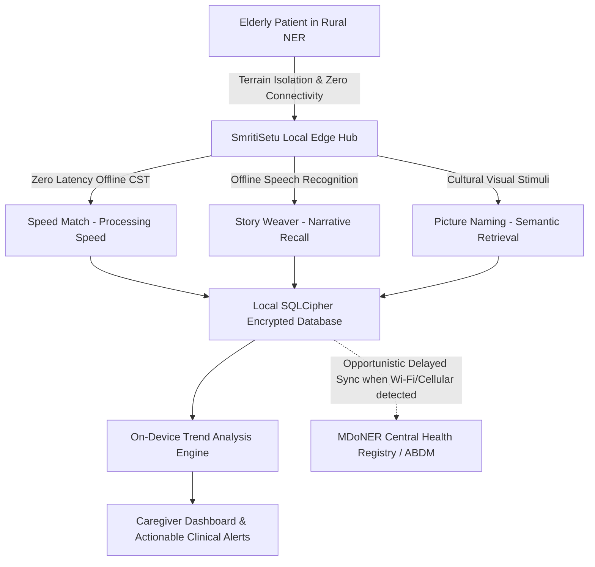

# SmritiSetu (স্মৃতিসেতু / ꯁ꯭ꯃ꯭ꯔꯤꯇꯤ ꯁꯦꯇꯨ) — Cognitive Gaming & Memory Assistance Platform

[](https://opensource.org/licenses/MIT)
[](https://expo.dev/)
[](https://reactnative.dev/)
[](https://onnxruntime.ai/)
[-003B57.svg)](https://www.sqlite.org/)
[](https://www.meity.gov.in/)
[](https://www.sih.gov.in/)
[](https://mdoner.gov.in/)

---

## 📌 Executive Summary & Elevator Pitch

**SmritiSetu** is an offline-first, culturally-grounded mobile cognitive stimulation therapy (CST) and memory rehabilitation platform engineered specifically for elderly individuals (ages 60+) exhibiting Mild Cognitive Impairment (MCI) and early-to-moderate dementia in the rural and hilly terrains of the North Eastern Region (NER) of India. Recognizing the near-total lack of continuous broadband connectivity in rural Assam, Manipur, Mizoram, and Nagaland, SmritiSetu executes 100% of its clinical assessments, gamified exercises, local dialect automatic speech recognition (ASR via quantized IndicConformer on ONNX Runtime Mobile), and longitudinal biometric tracking directly on low-tier consumer Android hardware with zero dependence on active internet connectivity. By fusing scientifically validated neuro-rehabilitation protocols (ACTIVE Cognitive Training Study and FINGER multidomain lifestyle intervention model) with indigenous cultural iconography (Assamese Bihu, Manipuri Loktak lake folklore, Bodo Handloom motifs, Mizo Chapchar Kut, and Ao Naga woodcraft) and delivering native speech interfaces in Assamese (`as`), Manipuri/Meiteilon (`mn`), and Bodo (`br`), SmritiSetu restores dignity, halts neurocognitive decay, empowers non-clinical tribal family caregivers, and upholds sovereign Indian healthcare privacy standards governed under the Digital Personal Data Protection Act (DPDA) 2023.

---

## 🎯 Problem Statement & Regional Context (SIH26003)

### The Sponsoring Body
* **Ministry**: Ministry of Development of North Eastern Region (MDoNER), Government of India
* **Problem Statement ID**: SIH26003
* **Title**: AI-Based Cognitive Gaming and Memory Assistance Platform for Elderly Dementia Patients in North Eastern Region (NER) of India
* **Target Geographic Focus**: Assam, Manipur, Mizoram, Nagaland, Meghalaya, Arunachal Pradesh, Tripura, and Sikkim.

### The Problem in Numbers
* **Dementia Burden**: According to the *Longitudinal Ageing Study in India (LASI)* and the *Dementia India Report*, dementia prevalence among individuals aged 60+ in rural Northeast India exceeds 7.4%, representing over 350,000 afflicted elders who have virtually no access to specialized psychogeriatric clinics.
* **Geographical Isolation**: Terrain barriers across the Patkai range, Barail range, and Brahmaputra floodplains cause persistent telecommunication blackouts. Cellular coverage drops to 2G or zero in over 42% of remote village habitations.
* **Linguistic Exclusion**: Standard cognitive screening tools (e.g., standard MMSE, MoCA) are standardized in English or standard Hindi, presenting extreme cultural-linguistic bias against native speakers of Assamese, Bodo, Manipuri, Mizo, and tribal dialects.
* **Caregiver Burnout**: More than 88% of dementia care in NER is delivered by family members (primarily adult children and spouses) who lack formal geriatric nursing guidance, objective progression telemetry, and emergency behavioral coping tools.



---

## 🏆 Key Features & Innovations

### 1. Zero-Cloud Dependent Clinical Gamification
* **Speed Match (প্ৰক্ৰিয়া বেগ / ꯌꯥꯡꯅꯥ ꯆꯥꯡꯗꯝꯅꯕ)**: Visual processing speed and executive attention assessment using high-contrast tribal textiles and rural fauna.
* **Story Weaver (সাধুকথা স্মৃতি / ꯋꯥꯔꯤ ꯅꯤꯡꯁꯤꯡꯕ)**: Acoustic narrative recall where patients listen to folk parables in their native mother tongue and speak responses; transcribed via on-device ASR.
* **Picture Naming (ছবি চিনাক্তকৰণ / ꯃꯁꯛ ꯈꯪꯗꯣꯛꯄ)**: Boston Naming Test methodology localized with indigenous cultural assets (e.g., Kaziranga one-horned rhinoceros, Manipuri polo Sagol Kangjei, Bodo Dokhona, Japi hats).

### 2. High-Performance On-Device Indic Speech AI
* Local offline Automatic Speech Recognition powered by **IndicConformer** INT8 quantized models executing via **ONNX Runtime Mobile (C++ / React Native JSI)**.
* Zero cloud calls for speech-to-text; voice processing latency is sub-320ms on MediaTek Helio G35 / Snapdragon 680 chipsets.
* Strict DPDA 2023 memory safety: microphone audio buffers reside strictly in volatile RAM, are transcribed into textual tokens, and the raw audio buffer is immediately zeroed and freed.

### 3. Asymmetric Offline-First State Synchronization
* Complete database storage using **SQLite** with **SQLCipher** AES-256 ciphering.
* Fully idempotent sync queue (`sync_queue`) with exponential backoff, state conflict resolution via Vector Clocks / Last-Write-Wins with Caregiver-Priority, and cryptographic hash verification.
* Resilient across arbitrary sudden device battery loss, sudden power outages, or intermittent 2G/EDGE data packets.

### 4. Elderly-First Universal Accessibility (WCAG 2.2 AAA + Dementia Specific)
* Minimum 64x64 dp touch target areas.
* Zero complex navigation hierarchies; single-level navigation with audio prompt repeats.
* High-contrast color palette (contrast ratio > 7:1) resistant to cataract optical distortions and macular degeneration.
* Tremor-resilient touch filters (touch-down damping, accidental double-tap absorption).

---

## 💻 Tech Stack Architecture

| Layer | Technology | Version | Purpose / Rationale |
| :--- | :--- | :--- | :--- |
| **Mobile Runtime** | React Native / Expo | SDK 50 (RN 0.73+) | Cross-platform rapid development, direct native module compilation via JSI. |
| **Language** | TypeScript | 5.3+ | Strict type safety across clinical scoring formulas, game states, and sync payloads. |
| **State Management** | Redux Toolkit + RTK Query | 2.0+ | Predictable deterministic state mutation, offline action recording, cache lifecycle. |
| **Persistence** | SQLite (`expo-sqlite`) | Current | Zero-latency structured local transactional query engine with WAL mode. |
| **Database Encryption**| SQLCipher / AES-256-GCM | Encrypted DB File | FIPS 140-2 level data-at-rest protection for patient cognitive medical records. |
| **Edge AI Runtime** | ONNX Runtime Mobile | 1.17+ | On-device hardware-accelerated neural network inference (NNAPI on Android). |
| **Acoustic Model** | IndicConformer (INT8 Quantized)| Custom ONNX | Low-resource speech recognition in Assamese (`as`), Manipuri (`mn`), Bodo (`br`). |
| **UI Components** | React Native Paper / Custom | 5.12+ | Material Design 3 accessibility components tuned for elderly motor impairments. |
| **Audio Processing** | `expo-av` + PCM Streamer | SDK 50 | 16kHz mono audio capture directly fed to in-memory ONNX tensor buffers. |
| **Backend (Cloud Sync)**| FastAPI (Python) | 0.109+ | High-throughput async gateway for receiving clinical sync batches when online. |
| **Cloud Database** | PostgreSQL + TimescaleDB | 16+ | Longitudinal patient trajectory tracking, multi-tenant hospital/PHC analytics. |
| **Containerization**| Docker & Docker Compose | 24+ | Uniform single-command developer environment bootstrap. |

---

## 📶 Offline Capability Matrix

SmritiSetu enforces an uncompromising offline-first paradigm. The matrix below defines application behavior across varying network conditions:

| Feature / Subsystem | Offline Mode (0.0 Kbps) | Intermittent / 2G EDGE | High-Speed 4G / Wi-Fi | Failover & Degradation Strategy |
| :--- | :--- | :--- | :--- | :--- |
| **User Authentication** | ✅ Local biometric / PIN auth via SQLCipher credentials | ✅ Local auth + opportunistic token refresh in background | ✅ Local auth + cloud token refresh | Local PIN hash stored in hardware keystore. No network required. |
| **Speed Match Game** | ✅ 100% playable; local asset bundle & scoring calculation | ✅ 100% playable; results queued in `sync_queue` | ✅ 100% playable; real-time background sync | Zero cloud dependency; assets compiled directly in standalone APK bundle. |
| **Story Weaver (Speech)**| ✅ 100% local ONNX IndicConformer transcription | ✅ 100% local ONNX; text transcription queued for sync | ✅ 100% local ONNX; text transcription queued for sync | If ONNX inference times out or RAM is constrained, switches to offline multi-choice narrative mode. |
| **Picture Naming** | ✅ 100% local asset deck & offline voice/touch scoring | ✅ 100% local; metrics queued | ✅ 100% local; metrics queued | All cultural imagery loaded from local bundle; offline phoneme matching. |
| **Cognitive Analytics** | ✅ On-device moving averages, standard deviation, Z-scores | ✅ Local computation; aggregates queued | ✅ Cloud aggregate dashboard sync | Moving 30-day baseline computed locally inside SQLite via analytical queries. |
| **Caregiver Alerts** | ✅ Local push notifications & alarm manager triggers | ✅ Local notifications + SMS dispatch queue | ✅ Local notifications + Cloud push notifications | Android AlarmManager dispatches high-priority notifications without internet. |
| **Audio Privacy** | ✅ Zero data egress; audio zeroed in RAM after ASR | ✅ Zero audio uploaded; only text scores synced | ✅ Zero audio uploaded; only text scores synced | Hard-coded cryptographic gate: raw audio upload endpoints do not exist. |
| **Model Updates** | ❌ Paused; current quantized ONNX model retained | ❌ Paused; checks manifest only | ✅ Differential model weights downloaded via Wi-Fi only | Model binary checksum validated before hot-swapping; fallback to default bundle. |

---

## 🚀 Quick Start Guide (Developer Bootstrap in 10 Minutes)

### Prerequisites
* **Node.js**: v18.18.0 or v20.x LTS
* **Package Manager**: `npm` (v9+) or `yarn` (v1.22+)
* **Python**: 3.11+ (for backend and model preparation scripts)
* **Java SDK**: OpenJDK 17 (for Android native builds)
* **Android Studio**: With Android SDK Platform 34, Build Tools, and NDK installed
* **Docker**: v24+ with Docker Compose v2 (optional for backend development)

### Step 1: Clone Repository & Setup Environment
```bash
# Clone the repository
git clone https://github.com/TeamNameSIH/AI-Based-Cognitive-Gaming-Platform-for-Elderly-Dementia-Patients-in-NER.git
cd AI-Based-Cognitive-Gaming-Platform-for-Elderly-Dementia-Patients-in-NER

# Copy environment variable templates
cp mobile-app/.env.example mobile-app/.env
cp backend/.env.example backend/.env
```

### Step 2: Install Mobile Dependencies
```bash
cd mobile-app
npm install
```

### Step 3: Run Mobile Application in Development Mode
```bash
# Start Expo Metro Bundler
npx expo start

# For Android Emulator or Connected Physical Device (Recommended for Speech & SQLite):
npx expo run:android
```

### Step 4: (Optional) Run Backend & Infrastructure Stack
```bash
cd ../infrastructure
docker compose up -d
```
The FastAPI documentation will be accessible at: `http://localhost:8000/docs`

---

## 🏛️ System Architecture Overview

```
                      +-------------------------------------------------+
                      |                SMRITISETU CLIENT                |
                      |        (Offline-First React Native App)         |
                      +-------------------------------------------------+
                                       |
    +----------------------------------+----------------------------------+
    |                                  |                                  |
    v                                  v                                  v
+-----------------------+  +-----------------------+  +-----------------------+
|   UI & Accessibility  |  |    Clinical Game      |  |  On-Device Edge AI    |
|   - WCAG 2.2 AAA      |  |       Engines         |  |  - ONNX Runtime JSI   |
|   - Cataract Contrast |  |  - Speed Match        |  |  - IndicConformer INT8|
|   - Tremor Damping    |  |  - Story Weaver       |  |  - Assamese/Bodo/Mei  |
|   - Multilingual Text |  |  - Picture Naming     |  |  - Audio Buffer Zeroer|
+-----------------------+  +-----------------------+  +-----------------------+
            |                                  |                                  |
            +----------------------------------+----------------------------------+
                                       |
                                       v
                      +---------------------------------+
                      |      Redux Toolkit Store        |
                      |  - Offline Action Interceptor   |
                      |  - Local Clinical State Reducers|
                      +---------------------------------+
                                       |
                                       v
                      +---------------------------------+
                      |    SQLite Local Database        |
                      |    (SQLCipher 256-bit AES)      |
                      |  - Patient Profiles             |
                      |  - Game Assessment Results      |
                      |  - Clinical Trend Baselines     |
                      |  - sync_queue (Idempotent Logs) |
                      +---------------------------------+
                                       |
                      [Opportunistic Background Sync Worker]
                          (NetInfo + Exponential Backoff)
                                       |
                                       | (Only when internet connectivity restored)
                                       v
                      +---------------------------------+
                      |     Cloud Ingestion Layer       |
                      |   - FastAPI Gateway             |
                      |   - PostgreSQL + TimescaleDB    |
                      |   - Anonymized Research Portal  |
                      +---------------------------------+
```

---

## 🌿 Cultural Adaptation for the North Eastern Region

Clinical cognitive assessment tools fail in rural Northeast India when they rely on Western or urban North Indian paradigms (e.g., recognizing microwave ovens or snowmen). SmritiSetu is natively built around the cultural anthropology and lived experiences of the Seven Sister States:

1. **Fauna & Flora of North East India**:
   * *Kaziranga One-horned Rhinoceros* (*Rhinoceros unicornis*)
   * *Manipur Sangai Deer* (*Rucervus eldii eldii*)
   * *Great Indian Hornbill* (*Buceros bicornis*) of Nagaland
   * *Mithun / Gayal* (*Bos frontalis*)
   * *Red Vanda Orchid* (*Renanthera imschootiana*)
   * *Assam Muga Silk Moth* (*Antheraea assamensis*)

2. **Folklore & Oral Traditions**:
   * **Assam**: *Burhi Aair Xadhu* (বুঢ়ী আইৰ সাধু) tales collected by Lakshminath Bezbaroa (e.g., *Tejimola*, *Chilani aru Kau*).
   * **Manipur**: *Khamba Thoibi* epic, folklore of Loktak Lake and floating islands (*Phumdis*).
   * **Bodo**: Folklore of *Kherai* worship and tales of the holy *Sijou* plant.
   * **Mizoram**: Legends of *Chhura* and *Nahaia*, harvest tales of *Chapchar Kut*.

3. **Material Culture & Everyday Artifacts**:
   * *Japi* (কঁহুৱা জাপি) traditional Assamese conical woven bamboo hat.
   * *Gamosa* (গামোচা) ceremonial red-and-white woven cotton towel.
   * *Dokhona* traditional attire of Bodo women.
   * *Innaphi* & *Phanek* handloom garments of Manipur.
   * *Longpi Ham* black stone pottery of the Tangkhul Naga.

---

## 🔒 Privacy, DPDA 2023 & Clinical Ethics

SmritiSetu treats patient privacy not as a setting, but as an inviolable hardware architecture:
1. **Zero Raw Audio Retention**: Voice recordings used for ASR narrative recall are processed purely within volatile memory and are zeroed via `memset` buffer operations immediately upon acoustic token extraction. No audio file is ever written to non-volatile disk.
2. **DPDA 2023 Section 6 & 9 Compliance**: Verifiable digital consent protocols are implemented for family caregivers representing cognitive patients with impaired legal agency.
3. **Encrypted Storage at Rest**: The SQLite database is secured via SQLCipher with key material derived from Android Keystore / iOS Secure Enclave using PBKDF2 with 100,000 iterations.
4. **Data Minimization**: Outbound sync payloads exclude all Personally Identifiable Information (PII), transmitting only pseudonymous UUID hashes and abstract normalized cognitive deviation scores.

---

## 👥 Core Team Members & Roles

Collaborating under GitHub Organization: [https://github.com/TeamNameSIH/AI-Based-Cognitive-Gaming-Platform-for-Elderly-Dementia-Patients-in-NER](https://github.com/TeamNameSIH/AI-Based-Cognitive-Gaming-Platform-for-Elderly-Dementia-Patients-in-NER)

| Role | Name | Responsibilities | Focus Domain |
| :--- | :--- | :--- | :--- |
| **Team Lead & Architect** | [Member 1 Name] | System architecture, DPDA compliance, repository hygiene, sync protocol. | Architecture / Full-Stack |
| **Mobile Engineer 1** | [Member 2 Name] | React Native gameplay engines (Speed Match & Picture Naming), animations. | Frontend / Game Engine |
| **Mobile Engineer 2** | [Member 3 Name] | SQLite schema implementation, SQLCipher integration, Redux store, UI/UX. | Frontend / Persistence |
| **AI / Edge ML Engineer** | [Member 4 Name] | ONNX Runtime Mobile integration, IndicConformer INT8 quantization, ASR pipeline.| Edge AI / Embedded ML |
| **Backend & Cloud Dev** | [Member 5 Name] | FastAPI sync endpoint, PostgreSQL schema, Docker orchestration, Alembic. | Backend / DevOps |
| **UI/UX & Clinical Evaluator**| [Member 6 Name] | WCAG 2.2 AAA accessibility, cultural asset curation (NER), usability testing. | UX Research / Testing |

---

## 📽️ Demo Video & Screen Previews

> [!NOTE]
> Demo video and high-resolution screen recordings will be attached below following the September 5, 2025 prototype gate.

* **Prototype Demo Video Link**: `https://youtu.be/placeholder-sih26003-demo`
* **Walkthrough Presentation Slides**: `docs/presentations/SIH26003_Pre_Final_Pitch.pdf`

| Speed Match (NER High Contrast) | Story Weaver (Assamese Speech) | Picture Naming (Cultural Assets) |
| :---: | :---: | :---: |
| *[Screenshot Placeholder: Speed Match]* | *[Screenshot Placeholder: Story Weaver]* | *[Screenshot Placeholder: Picture Naming]* |

---

## 📜 License & Acknowledgments

This project is licensed under the **MIT License** - see the [LICENSE](file:///d:/Project/SIH/LICENSE) file for details.

Developed with deep humility and scientific rigor for the elderly citizens of the North Eastern Region of India, under the auspices of the **Smart India Hackathon 2025** and the **Ministry of Development of North Eastern Region (MDoNER)**.
