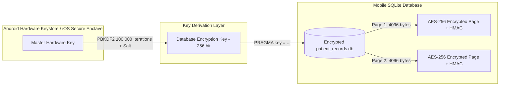
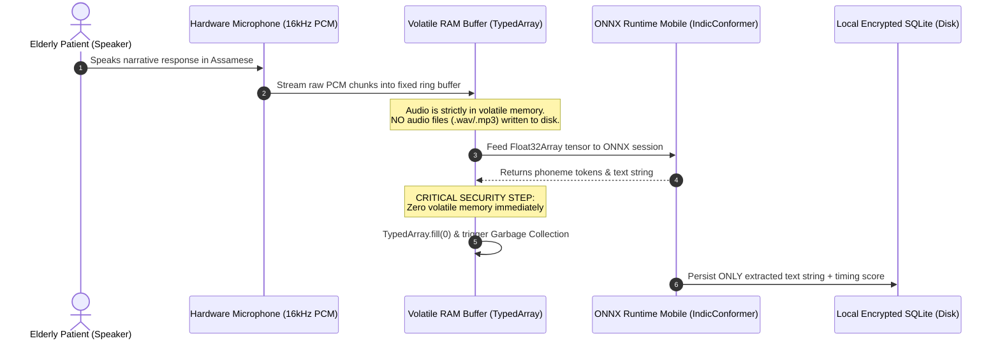
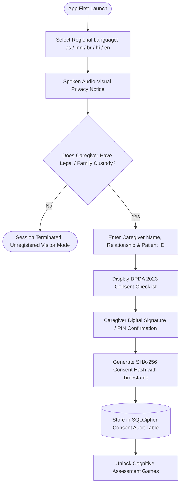

# SmritiSetu (SIH26003) — Security Policy & DPDA 2023 Compliance Architecture

## 🛡️ Security Posture & Healthcare Compliance Overview

SmritiSetu processes cognitive assessment metrics and voice interaction data for vulnerable elderly patients in North Eastern India. Because cognitive performance metrics constitute **Sensitive Personal Data (SPD)** and health telemetry, our security model conforms strictly to:
1. **Digital Personal Data Protection Act (DPDA) 2023 (Government of India)**
2. **CDSCO Guidelines for Software as a Medical Device (SaMD)**
3. **ICMR National Ethical Guidelines for Biomedical Research**
4. **FIPS 140-2 Cryptographic Standards for Edge Data Storage**

---

## ⚖️ Statutory Mapping: Digital Personal Data Protection Act (DPDA) 2023

| DPDA 2023 Section | Statutory Requirement | SmritiSetu Architectural Implementation |
| :--- | :--- | :--- |
| **Section 4** (Grounds for Processing) | Lawful processing based on clear consent. | Consent recorded in local encrypted DB before any assessment unlocks. |
| **Section 5** (Notice) | Clear, multi-lingual notice describing data collected and usage. | Audio-visual spoken notice rendered in Assamese, Manipuri, Bodo, Hindi, and English. |
| **Section 6** (Consent) | Free, specific, informed, unconditional, and revocable consent. | Caregiver digital proxy signature stored with cryptographic timestamp; revocable at any time. |
| **Section 8** (Data Principal Obligations) | Processing must maintain accuracy, integrity, and security safeguards. | On-device SQLite encrypted with SQLCipher (AES-256-GCM); zero unencrypted disk writes. |
| **Section 9** (Processing of Children/Vulnerable Persons) | Protection of individuals with impaired decision-making capacity. | Legal guardian/caregiver proxy authentication protocol with relationship proof logging. |
| **Section 11** (Right to Grievance Redressal) | Accessible mechanism to address privacy and data grievances. | Dedicated Data Protection Officer (DPO) contact endpoint and local audit trail export. |

---

## 🔐 Cryptographic Architecture: Edge Storage & SQLCipher

All persistent storage on the mobile client utilizes **SQLCipher** (AES-256 in CBC or GCM mode with HMAC-SHA512 per-page integrity verification).



### Key Generation and Storage Flow
1. Upon first app launch, the application checks `expo-secure-store`.
2. If no encryption key exists, a cryptographically secure 256-bit pseudo-random string is generated via `crypto.getRandomValues()`.
3. The key is stored inside the OS Hardware Keystore (`Android KeyStoreProvider` / `iOS Keychain Services`) protected by device biometric authentication or a 6-digit master Caregiver PIN.
4. Database connections are initialized with:
   ```sql
   PRAGMA key = "x'2c75a4...raw_hex_key...'";
   PRAGMA cipher_page_size = 4096;
   PRAGMA kdf_iter = 100000;
   PRAGMA cipher_hmac_algorithm = HMAC_SHA512;
   PRAGMA cipher_default_kdf_algorithm = PBKDF2_HMAC_SHA512;
   ```

---

## 🎙️ Strict Audio Deletion Protocol (Zero Raw Audio Retention)

Under DPDA 2023 Section 8, raw audio of elderly cognitive patients must **never** be stored permanently or transmitted across network interfaces without explicit affirmative consent. SmritiSetu executes a strict in-memory streaming deletion pipeline:



### Detailed Deletion Steps:
1. **Direct In-Memory Buffering**: Microphone stream is captured via `expo-av` in raw PCM format directly into an internal circular `ArrayBuffer` in memory.
2. **No Temp Files**: The app does not write intermediate `.wav` or `.m4a` files to `FileSystem.cacheDirectory` or `FileSystem.documentDirectory`.
3. **Inference Execution**: The audio buffer is passed directly across the React Native JSI bridge to the native ONNX Runtime C++ engine.
4. **Immediate Overwrite & Memory Zeroing**: Immediately following `session.run()`, the underlying `Float32Array` buffer is explicitly overwritten with zeroes (`buffer.fill(0)`) to mitigate memory-scraping vulnerabilities.
5. **Disk Write**: Only the derived textual transcription string and calculated fluency score are persisted into SQLite.

---

## 📝 Caregiver Digital Proxy Consent Flow

Because patients exhibiting moderate-to-severe cognitive impairment cannot legally provide informed consent, SmritiSetu incorporates a structured caregiver proxy authorization flow:



---

## 📶 OFFLINE BEHAVIOR SPECIFICATION (Security & Privacy Subsystem)

### 1. What happens when security runs with zero internet connectivity?
* All cryptographic operations (key retrieval, SQLCipher database decryption, local PIN hashing via PBKDF2, consent hash generation via SHA-256) operate **100% locally on the device**.
* Zero external cryptographic or licensing servers are contacted.
* Authentication and authorization gates never fail open; if the local key cannot be decrypted from the Android Keystore, access to patient records is securely blocked.

### 2. What data is stored locally vs. requires cloud?
* **Stored Locally (Encrypted)**: Patient pseudonymous profile, Caregiver proxy consent record with SHA-256 hash, all game assessment scores, local moving average baselines, ONNX model weights, localized static dictionary assets.
* **Requires Cloud (Deferred/Optional)**: Anonymized population-level epidemiological analytics, multi-centre longitudinal study synchronization, remote clinical telemedicine reports.
* **Never Stored Anywhere (Neither Local Nor Cloud)**: Raw audio recordings, unencrypted biometric identifiers, raw voice waveforms.

### 3. What is the fallback/degradation strategy if cloud is unreachable?
* The local security gate continues operating indefinitely.
* Remote credential revocation lists (CRL) are checked opportunistically only when internet becomes available; in offline mode, validity is governed by local hardware keystore policy.

### 4. How does the user know they're in offline mode? (UI indicators)
* A high-contrast security badge is persistently rendered in the top status bar:
  * 🟢 **"অফলাইন সুৰক্ষিত (Offline Secured - AES-256)"** when offline.
  * 🟡 **"সুৰক্ষিত সংমিশ্ৰণ (Secured Sync Pending)"** when records are queued in `sync_queue`.
  * 🔵 **"সংযোগ হৈছে (Connected & Synced)"** during cloud sync handshakes.

### 5. How does data integrity survive app crashes during offline operation?
* SQLite is configured in **Write-Ahead Logging (WAL)** mode (`PRAGMA journal_mode = WAL;`) with synchronous transactions (`PRAGMA synchronous = NORMAL;`).
* In the event of a sudden battery drop or OS process termination during gameplay, the last completed round transaction is fully preserved, and the database automatically recovers uncommitted writes upon next startup.

---

## 🚨 Vulnerability Reporting

If you discover a security vulnerability or potential privacy flaw in SmritiSetu:
1. **Do not create a public GitHub Issue.**
2. Email the Lead Architect directly at: `sih26003-security@doner.gov.in` (or notify via secure private channel).
3. Include detailed steps to reproduce and proof-of-concept code.
4. The maintainers will respond within **24 hours** with an acknowledgment and remediation timeline.
