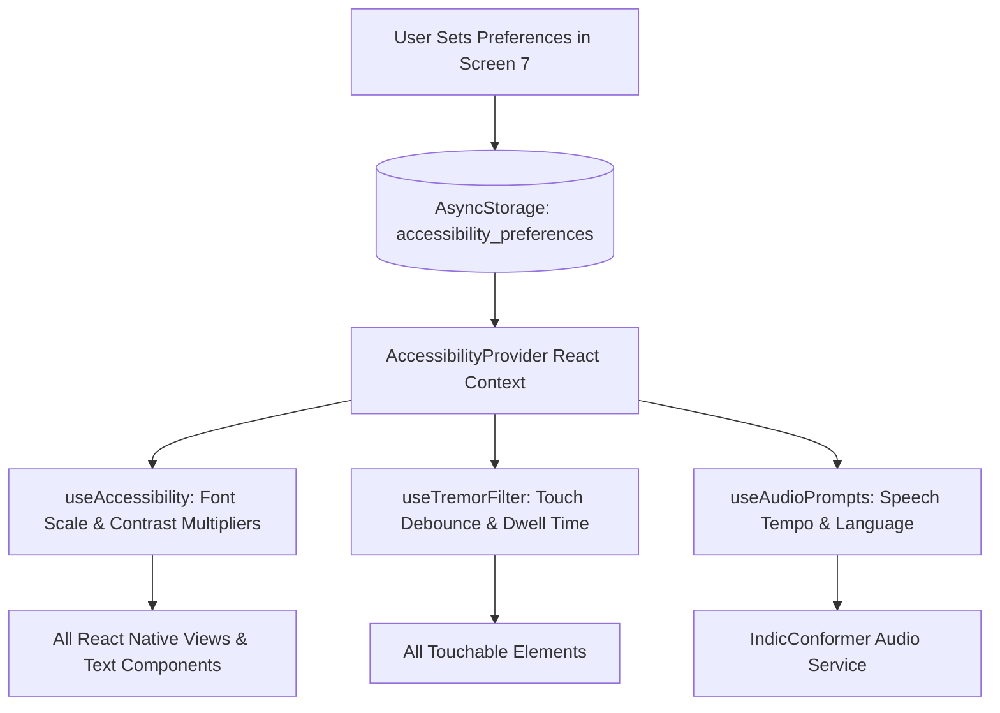

# SmritiSetu (SIH26003) — Accessibility Settings Global Persistence & Context Architecture

## ♿ 1. Architecture Overview

Accessibility in SmritiSetu is not a superficial stylesheet skin; it is a **dynamic, reactive execution runtime** providing immediate sensory accommodation across all mobile screens.



---

## 💾 2. Persistence Schema (`AsyncStorage`)

```typescript
export interface AccessibilityPreferences {
  vision: {
    fontScale: 'STANDARD' | 'LARGE' | 'EXTRA_LARGE';
    fontSizeMultiplier: number; // 1.0, 1.25, 1.5
    highContrast: boolean;      // Pure Black (#121212) & Pure Gold (#FFD700)
    enableTextShadows: boolean; // Increased letter separation
  };
  hearing: {
    audioSpeed: '0.75x' | '1.0x';
    autoPlayPrompts: boolean;
    volumeBoost: boolean;
  };
  interaction: {
    tremorDamping: boolean;
    debounceIntervalMs: number; // Default: 600ms
    minDwellTimeMs: number;     // Default: 80ms
    disableGestures: boolean;   // Enforces single-tap only
  };
}
```

---

## ⚛️ 3. React Context Implementation (`AccessibilityContext.tsx`)

```tsx
import React, { createContext, useContext, useState, useEffect } from 'react';
import AsyncStorage from '@react-native-async-storage/async-storage';

const DEFAULT_PREFERENCES: AccessibilityPreferences = {
  vision: {
    fontScale: 'STANDARD',
    fontSizeMultiplier: 1.0,
    highContrast: true,
    enableTextShadows: false,
  },
  hearing: {
    audioSpeed: '1.0x',
    autoPlayPrompts: true,
    volumeBoost: false,
  },
  interaction: {
    tremorDamping: true,
    debounceIntervalMs: 600,
    minDwellTimeMs: 80,
    disableGestures: true,
  },
};

const AccessibilityContext = createContext<{
  preferences: AccessibilityPreferences;
  updatePreferences: (newPrefs: Partial<AccessibilityPreferences>) => Promise<void>;
}>({
  preferences: DEFAULT_PREFERENCES,
  updatePreferences: async () => {},
});

export const AccessibilityProvider: React.FC<{ children: React.ReactNode }> = ({ children }) => {
  const [preferences, setPreferences] = useState<AccessibilityPreferences>(DEFAULT_PREFERENCES);

  useEffect(() => {
    const loadStoredPreferences = async () => {
      try {
        const stored = await AsyncStorage.getItem('accessibility_preferences');
        if (stored) {
          setPreferences(JSON.parse(stored));
        }
      } catch (err) {
        console.warn('Failed to load accessibility preferences, using clinical defaults');
      }
    };
    loadStoredPreferences();
  }, []);

  const updatePreferences = async (newPrefs: Partial<AccessibilityPreferences>) => {
    const merged = { ...preferences, ...newPrefs };
    setPreferences(merged);
    await AsyncStorage.setItem('accessibility_preferences', JSON.stringify(merged));
  };

  return (
    <AccessibilityContext.Provider value={{ preferences, updatePreferences }}>
      {children}
    </AccessibilityContext.Provider>
  );
};

export const useAccessibility = () => useContext(AccessibilityContext);
```

---

## 🕹️ 4. Per-Screen Overrides & Game Safety Enforcement

While caregivers and patients can adjust font scaling and audio speeds, clinical game engines enforce **non-negotiable safety minimums**:
1. **Speed Match & Picture Naming**:
   * Minimum touch target size is permanently locked to $\ge 64\times 64\text{ dp}$ regardless of any custom downscaling attempts.
   * Tremor damping is permanently enforced at $\ge 500\text{ms}$ debounce during all game rounds to prevent false error deductions.
2. **Story Weaver**:
   * Microphone capture threshold automatically normalizes against ambient background village noise (roosters, rain on tin roofs) using a dynamic spectral noise floor.
