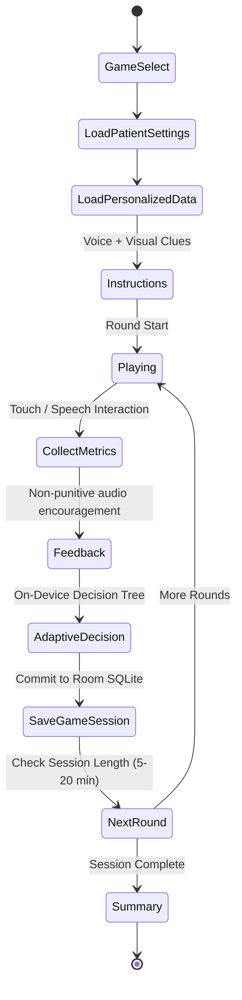

# AASRITI SYSTEM ARCHITECTURE & ENGINEERING SPECIFICATION
## `/docs/ARCHITECTURE.md` — Authoritative Full-Product Architecture

> **APPLICATION**: AASRITI (SIH-26003: AI-Based Cognitive Gaming & Memory Assistance Platform)  
> **CORE ARCHITECTURAL AXIOM**: **"ROOM LOCAL SQLITE IS KING. FIREBASE IS THE MESSENGER."**  
> **TARGET ENVIRONMENT**: 100% Autonomous Offline Execution in Rural North Eastern Region (NER) of India

---

## 🏛️ 1. ARCHITECTURAL OVERVIEW & TECHNOLOGY STACK

AASRITI is engineered as an offline-first, native Android application using Clean Architecture with Feature-First packaging.

```
┌─────────────────────────────────────────────────────────────────────────────┐
│                           AASRITI FULL-STACK TOPOLOGY                       │
├─────────────────────────────────────────────────────────────────────────────┤
│                                                                             │
│   PRESENTATION LAYER (Jetpack Compose + Material 3)                        │
│   ├── Patient UI (Very Low Density: Flower Match, Trivia, Memory Garden)   │
│   ├── Caregiver UI (Low-Med Density: Today's Priority, Quick Log, Triage)   │
│   ├── ASHA Worker UI (Med Density: Multi-Patient Roster, Field Visit Log)   │
│   └── Doctor UI (Med-High Density: Longitudinal Signals, PDF Export)        │
│                                      │                                      │
│                                      ▼ (StateFlow / UDF Events)             │
│   DOMAIN LAYER (Pure Kotlin — Zero Android / Room Dependencies)             │
│   ├── Models (Patient, GameSession, MemoryItem, CareLog, PrioritySignal)    │
│   ├── Repositories (Interfaces: GameRepository, PatientRepository, etc.)    │
│   └── Decision Engines:                                                     │
│       ├── AdaptiveEngine (On-device Decision Tree difficulty scaler)        │
│       ├── PriorityEngine (Deterministic care triage evaluator)              │
│       └── TrendEngine (Longitudinal reaction time & hesitation analyzer)    │
│                                      │                                      │
│                                      ▼ (Mappers: toEntity() / toDomain())   │
│   DATA & PERSISTENCE LAYER (Local-First Single Source of Truth)             │
│   ├── Room SQLite Database (aasriti.db — 7 DAOs, WAL Mode)              │
│   ├── Local File Storage (context.filesDir/media/ for photos & voice)       │
│   ├── Offline Sync Queue (sync_queue SQLite table)                          │
│   └── AlarmManager & Broadcast Receivers (Offline local reminders)          │
│                                      │                                      │
│                                      ▼ (Opportunistic Drainage on Network)  │
│   SECONDARY REPLICATION LAYER (Cloud Messenger — Non-Blocking)              │
│   ├── WorkManager SyncWorker (Background job triggered by connectivity)     │
│   ├── Cloud Firestore (Replication target for caregiver/doctor sync)       │
│   └── Firebase Storage (Backup for memory garden photos & audio)            │
│                                                                             │
└─────────────────────────────────────────────────────────────────────────────┘
```

### Technology Matrix:
* **Operating System**: Android Native (Minimum SDK 24 / Android 7.0; Compile/Target SDK 34 / Android 14).
* **Language & Runtime**: Kotlin 1.9+ (Coroutines, StateFlow, Strict Null Safety).
* **UI Toolkit**: Jetpack Compose (Material 3 with custom `AasritiTheme` design tokens).
* **Local Persistence**: Room SQLite (`androidx.room:room-ktx`) in Write-Ahead Logging (WAL) mode.
* **On-Device Machine Learning**: Scikit-Learn trained Decision Tree classifier exported to JSON and evaluated locally in Kotlin in $<1\text{ms}$. Zero cloud ML dependencies.
* **Audio & Speech Engine**: Native Android `TextToSpeech` calibrated to $0.85\times$ elderly rate + pre-recorded native Assamese, Manipuri, and English prompt audio packs.
* **Cloud Infrastructure (Secondary)**: Firebase Firestore, Firebase Authentication, Firebase Storage.

---

## 🗂️ 2. FEATURE BOUNDARIES & PACKAGE ORGANIZATION

The codebase is organized by feature rather than layer to allow 6 developers to work concurrently with minimal merge conflicts:

```text
com.sih26003.aasriti/
├── MainActivity.kt                  # Single-activity NavHost wrapped in AasritiTheme
├── AasritiApplication.kt         # Application container & dependency wiring
├── core/
│   ├── ui/                          # Canonical design system (Theme, Color, Type, Shape, Spacing)
│   ├── security/                    # CryptoUtils, PIN hashing, SHA-256
│   └── util/                        # DateFormatters, Result wrappers
├── data/
│   ├── local/
│   │   ├── dao/                     # 7 Room DAOs (PatientDao, GameDao, LogDao, etc.)
│   │   ├── entity/                  # Room SQLite Entities (Zero UI imports allowed)
│   │   └── database/                # AppDatabase singleton (aasriti.db)
│   ├── mapper/                      # Explicit Entity <-> Domain Model extension functions
│   ├── repository/                  # Concrete repository implementations
│   └── firebase/                    # Secondary Firestore sync messenger
├── domain/
│   ├── model/                       # Pure Kotlin immutable domain data classes
│   └── repository/                  # Domain repository interfaces
├── engine/
│   ├── adaptive/                    # DecisionTreeEngine (Difficulty 1–5 scaler)
│   ├── priority/                    # PriorityEngine (Deterministic care triage rules)
│   ├── reminder/                    # ReminderScheduler (AlarmManager & BootReceiver)
│   └── trend/                       # Longitudinal reaction time & hesitation analyzer
├── feature/
│   ├── auth/                        # RoleAndModeSelectScreen, PinAuthScreen
│   ├── patient/                     # PatientHomeScreen (Zero PIN, Very Low Density)
│   ├── games/                       # CommonGameFramework + 6 cognitive games
│   ├── memoryalbum/                 # Memory Garden reminiscence photo & audio player
│   ├── caregiver/                   # CaregiverDashboardScreen, QuickLogDialog
│   ├── asha/                        # Multi-patient community roster & batch sync
│   └── doctor/                      # DoctorAccessScreen, PatientSnapshot, Trends
├── sync/                            # SyncManager, SyncQueueProcessor, ConnectivityObserver
├── voice/                           # VoicePromptManager, TTSManager, LanguageManager
└── cultural/                        # ThemePack contracts, Assam/Manipur/Meghalaya themes
```

---

## 🚫 3. CLEAN ARCHITECTURE MODEL SEPARATION & MAPPERS

To eliminate ambiguity between persistence entities and presentation models, AASRITI strictly enforces:

1. **`data/local/entity/`**:
   - Contains Room-annotated SQLite tables (`PatientEntity`, `GameSessionEntity`, `ReminderEntity`, `CareLogEntity`, `UserEntity`, `RelationshipEntity`, `SyncQueueEntity`).
   - Represents raw database schema, foreign keys, and indices.
   - **RULE**: Room entities are strictly internal to the `data/` layer. They must **NEVER** be imported into `feature/`, UI composables, or ViewModels.

2. **`domain/model/`**:
   - Contains pure, immutable Kotlin data classes (`Patient`, `GameSession`, `Reminder`, `CareLog`, `Relationship`).
   - Completely free of Android, Room, or Firebase annotations.
   - Used across ViewModels, UI Composables, and Domain Use Cases.

3. **`data/mapper/`**:
   - Contains explicit Kotlin extension functions:
     ```kotlin
     fun PatientEntity.toDomain(): Patient
     fun Patient.toEntity(): PatientEntity
     fun GameSessionEntity.toDomain(): GameSession
     fun GameSession.toEntity(): GameSessionEntity
     ```
   - Encapsulates JSON conversions, default values, and migration fallbacks.

---

## 👥 4. FOUR DISTINCT USER ROLES

```
┌─────────────────────────────────────────────────────────────────────────────┐
│                               AASRITI USERS                                 │
├───────────────────┬───────────────────┬───────────────────┬─────────────────┤
│      PATIENT      │     CAREGIVER     │       ASHA        │     DOCTOR      │
├───────────────────┼───────────────────┼───────────────────┼─────────────────┤
│ • Zero PIN        │ • Local 6-digit   │ • Shared-device   │ • Local PIN +   │
│   (Photo tap)     │   PIN (SHA-256)   │   multi-patient   │   Doctor Access │
│ • 6 Cognitive     │ • Patient profile │ • Patient switch  │   Code          │
│   Games           │ • Today's Priority│ • Quick Field Log │ • My Patients   │
│ • Memory Garden   │ • Quick Log (<30s)│ • Flag review     │ • 7/30/90 Day   │
│ • Offline Voice   │ • Reminders       │ • Batch offline   │   Trends        │
│ • Offline Alarms  │ • Memory Garden   │   synchronization │ • Neutral Flags │
│ • SOS Help Button │ • Emergency / SOS │ • Caregiver alert │ • 1-Page PDF    │
│ • No Analytics    │ • Doctor Access   │   handover        │ • Zero Medical  │
│                   │   Code generation │                   │   Diagnosis     │
└───────────────────┴───────────────────┴───────────────────┴─────────────────┘
```

> [!IMPORTANT]
> **ASHA Workflows are NOT Caregiver Screens**: ASHA workers visit multiple elderly households in rural villages using a single tablet or phone. The ASHA module explicitly provides **Patient Switching**, **Batch Offline Logging**, and **Community Observation Registers** without requiring personal family access.

---

## 🔄 5. DATA PERSISTENCE & THE SYNC QUEUE CONTRACT

### The "Room is King" Principle:
1. Every write operation (saving game session, logging a fall, creating a reminder, adding a family member) writes **synchronously and immediately** to Room SQLite.
2. The UI state updates instantly from Room's reactive `Flow<T>` queries. The application never waits for network confirmation.
3. Every write transaction simultaneously inserts a pending mutation record into the `sync_queue` table:
   ```sql
   CREATE TABLE sync_queue (
       id TEXT PRIMARY KEY,
       table_name TEXT NOT NULL,
       record_id TEXT NOT NULL,
       operation TEXT NOT NULL,       -- 'INSERT', 'UPDATE', 'DELETE'
       payload_json TEXT NOT NULL,
       timestamp INTEGER NOT NULL,
       retry_count INTEGER DEFAULT 0,
       status TEXT DEFAULT 'PENDING'  -- 'PENDING', 'SYNCED', 'FAILED'
   );
   ```
4. `SyncQueueProcessor` listens to `ConnectivityObserver`. When network is established (Wi-Fi or Cellular), it drains the queue in chronological order, posting records to Firebase Firestore.
5. On HTTP 200 OK / Firestore ACK, the local queue item status is marked `SYNCED`. **Local Room data is never purged.**

---

## 🎮 6. UNIFIED SIX-GAME FRAMEWORK & ENGINE CONTRACTS

All six cognitive games inherit from the unified `CommonGameFramework` and enforce the 5-level adaptive difficulty curve:



### Standardized Game Engine Contracts:
* `GameDefinition`: Metadata, clinical domain, supported difficulty levels (1–5).
* `GameState`: Reactive state containing current round, timer, active stimuli, distractors, and score.
* `GameAction`: User inputs (`TapOption`, `DragItem`, `VoiceResponseReceived`, `Timeout`).
* `GameResult`: Round outcome (`isCorrect`, `reactionTimeMs`, `hesitationGaps`, `errorCount`).
* `GameSession`: Domain model written to Room capturing duration, accuracy, and adaptation recommendation.
* `GameTelemetry`: Real-time touch coordinates, tap latency, and pauses.

### The Six Games & Clinical Domains:
1. **Family Trivia** (`পৰিয়ালৰ স্মৃতি`): Memory & Identity Preservation — photo and relationship recognition from Room `relationships`.
2. **Voice Cue Card** (`কণ্ঠ আৰু ছবি`): Attention & Recall — spoken audio prompts with 5-second voice fallback and touch cards.
3. **Daily Sequencing** (`দৈনন্দিন ক্ৰম`): Executive Function — chronological steps of daily routines (Assam tea, morning Namghar routine) with distractors.
4. **Categorisation** (`শ্ৰেণীবিভাজন`): Categorical Thinking — grouping fruits, vegetables, animals, and traditional textiles.
5. **Village Market** (`গাঁওৰ বজাৰ`): Working Memory & Visual Search — shopping list recall with authentic regional items (Joha rice, Kaji nemu).
6. **Pattern / Object Matching + Mental Rotation** (`আৰ্হি চিনাক্তকৰণ`): Visuospatial Processing — high-contrast geometric motifs and rotated cultural symbols.

---

## 🧠 7. ON-DEVICE ADAPTIVE ML ENGINE (ZERO LLM)

### Design & Safety Rationale:
Elderly cognitive gaming must run reliably on low-cost devices in offline village environments. Generic LLMs or heavy neural networks require continuous internet, consume excessive battery, and introduce hallucination risks.

### Decision Tree Architecture:
1. **Training**: `scripts/train_decision_tree.py` trains a `DecisionTreeClassifier` with `max_depth = 4` on clinical telemetry benchmarks (Reaction Time, Error Rate, Hesitation Duration, Hint Requests).
2. **Export**: The tree is exported to a clean JSON structure (`assets/ml/decision_tree_difficulty.json`).
3. **Execution**: `engine/adaptive/DecisionTreeEngine.kt` parses the tree into an in-memory decision node structure and evaluates difficulty recommendations in **$<0.5\text{ms}$** with zero memory allocation.
4. **Safety Bound**: Difficulty scaling is capped at $\pm 1$ step per session to prevent sudden disorientation.

---

## 🏥 8. PRIORITY & CLINICAL TRIAGE ENGINE

### Deterministic Rule-Based Triage:
To eliminate black-box unpredictability, caregiver and clinical priority calculation uses transparent deterministic logic:
* **Level 1: Normal (Green)**: All routines completed within $\pm 2$ hours; stable reaction time ($\pm 15\%$).
* **Level 2: Watch (Amber)**: 1 missed hydration reminder; mild reaction time increase ($+20\%–35\%$).
* **Level 3: Priority (Orange)**: 2 consecutive missed medication doses; participation dropped for $>48$ hours.
* **Level 4: Urgent (Cranberry `#8B183F`)**: Bedside fall logged by caregiver/ASHA; sudden disorientation episode.

---

## 🎨 9. CULTURAL THEME ENGINE (`cultural/`)

The Cultural Theme Engine personalizes games, objects, and visual assets according to the patient's cultural background, **independently of UI language**:

```
[Cultural Theme Pack: Assam / Manipur / Meghalaya]
       │
       ├── Foods:      Assam Tea, Pitha, Kaji Nemu vs Manipuri Chak-hao vs Khasi Rice
       ├── Objects:    Japi, Gamosa vs Radha-Krishna Pung, Meitei Pot vs Ryndia Shawl
       ├── Music:      Borgeet, Flute vs Pena Melodies vs Traditional Khasi Tunes
       └── Markets:    Bihu Village Haat vs Khwairamband Bazar vs Iewduh Market
```

* **Decoupled Architecture**: An Assamese patient who prefers English UI still experiences authentic Assam cultural items and motifs.
* **Extensibility**: Modular theme pack contracts (`cultural/ThemePack.kt`) allow adding further NER states without modifying core game logic.

---

## 🔊 10. SHARED VOICE & ACCESSIBILITY SUBSYSTEM

* **Horizontal Service**: `VoicePromptManager` is a singleton service accessible across all games and views.
* **Elderly Speech Calibration**: Android `TextToSpeech` rate is set to **$0.85\times$** standard speed with slightly elevated pitch (+10%) to compensate for age-related high-frequency hearing loss.
* **Pre-Recorded Audio Packs**: Where TTS lacks regional dialect inflection, high-quality human audio clips are loaded from `assets/audio/<lang>/` (Assamese, English, Manipuri).

---

## 🧪 11. TESTING & VALIDATION STRATEGY

```
┌────────────────────────────────────────────────────────┐
│                   TEST PYRAMID                         │
│                                                        │
│                    / \                                 │
│                   /E2E\     Airplane Mode Demo Run     │
│                  /-----\                               │
│                 / Integ \   Room DB & Sync Worker      │
│                /---------\                             │
│               /   Unit    \ ML, Engines, Mappers, DAOs │
│              /─────────────\                           │
└────────────────────────────────────────────────────────┘
```

1. **Unit Tests (`app/src/test/`)**:
   - `DecisionTreeEngineTest`: Validates difficulty transition boundaries.
   - `PriorityEngineTest`: Validates deterministic triage rules.
   - `MapperTest`: Guarantees bi-directional fidelity between Entities and Domain Models.
2. **Database Integration Tests**:
   - In-memory SQLite Room tests verifying cascade deletes and query speed.
3. **End-to-End Verification**:
   - 16-step SIH demo script executed with device in Airplane Mode (0 Kbps).
