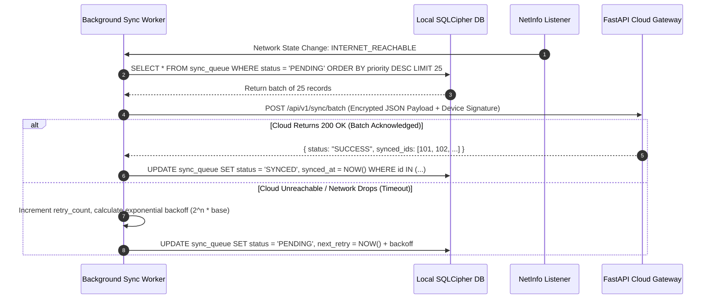

# SmritiSetu (SIH26003) — System Architecture Specification

## 🏗️ 1. Architectural Philosophy: The Zero-Cloud Edge Paradigm

SmritiSetu is engineered specifically for rural districts of the North Eastern Region of India (Assam, Manipur, Mizoram, Nagaland), where telecommunications infrastructure is notoriously brittle due to mountainous topography, monsoon flooding, and frequent power outages.

Rather than treating offline mode as a degraded fallback ("offline mode"), SmritiSetu defines **the Edge Mobile Device as the Single Source of Truth**. The cloud is treated as an optional, asynchronous, non-blocking telemetry recipient.

```mermaid
graph TD
    subgraph Mobile Edge Device (100% Autonomous)
        UI[Elderly-Optimized React Native UI]
        Audio[Microphone PCM Streamer]
        ONNX[ONNX Runtime Mobile - IndicConformer]
        RTK[Redux Toolkit Store]
        DB[(Local SQLCipher Encrypted SQLite)]
        SyncWorker[Background Sync Worker]
    end

    subgraph Optional Cloud Gateway (Only Reached when Online)
        API[FastAPI Gateway]
        CloudDB[(PostgreSQL + TimescaleDB)]
        ABDM[Ayushman Bharat Digital Mission]
    end

    UI -->|Player Actions & Scores| RTK
    Audio -->|16kHz PCM Chunks| ONNX
    ONNX -->|Extracted Text Tokens| RTK
    RTK -->|Immediate ACID Transaction| DB
    DB -->|Read Cached Trends & Baselines| UI
    DB -->|Read Pending Batches| SyncWorker
    SyncWorker -.->|Opportunistic Idempotent Sync| API
    API --> CloudDB
    API -.-> ABDM
```

---

## 🧩 2. Subsystem Decomposition

### 2.1 Presentation & Interaction Layer (`mobile-app/src/features/`)
* **Elderly Interaction Filter**: Intercepts touch inputs to apply motor tremor damping, debouncing rapid duplicate taps, and filtering unintended boundary touches.
* **Multilingual Audio/Visual Prompt Engine**: Plays pre-rendered high-definition native voice prompts (Assamese, Manipuri, Bodo, Hindi, English) stored directly within the local APK bundle.
* **Clinical Game Viewports**: Renders the three CST games (Speed Match, Story Weaver, Picture Naming) at a locked 60 FPS on low-end Mali-G52 and Adreno 610 GPUs.

### 2.2 On-Device Edge AI Subsystem (`mobile-app/src/services/ai/`)
* **Inference Engine**: ONNX Runtime Mobile via React Native JSI (JavaScript Interface), bypassing asynchronous JSON bridge overhead for direct C++ memory pointers.
* **IndicConformer ASR Model**: 8-bit quantized (INT8) acoustic-linguistic model footprint under 38MB, loaded directly into memory using Android Neural Networks API (NNAPI).
* **Volatile Memory Guard**: Manages a fixed circular buffer for 16kHz mono audio. Guarantees raw PCM arrays are zeroed with `TypedArray.prototype.fill(0)` immediately post-inference.

### 2.3 Local Persistence & State Layer (`mobile-app/src/database/` & `src/store/`)
* **Redux Toolkit**: Holds current session telemetry, volatile game state, active patient profile ID, and sync queue status.
* **SQLite with SQLCipher**: Encrypted local database holding 7 relational tables: `patients`, `caregivers`, `game_sessions`, `cognitive_metrics`, `consent_logs`, `sync_queue`, and `cultural_content`.
* **Analytical Queries**: Computes 30-day moving averages, standard deviation, and Z-score deviation curves entirely in local SQL without cloud processing.

### 2.4 Synchronization Subsystem (`mobile-app/src/services/sync/`)
* **Network Monitor**: Hooks `NetInfo` to detect genuine internet reachability (probing DNS/HTTP beyond mere local Wi-Fi association).
* **Sync Engine**: Pulls un-synced batches from `sync_queue`, attaches cryptographic device signatures, and posts to the FastAPI gateway with exponential backoff and jitter.

---

## 🔄 3. End-to-End Data Flow Diagrams

### 3.1 Cognitive Assessment & Speech Processing Flow
```mermaid
sequenceDiagram
    autonumber
    actor Elder as Elderly Patient
    participant UI as Game Interface
    participant Mic as expo-av Audio Recorder
    participant RAM as Volatile PCM Buffer
    participant ASR as ONNX Runtime Mobile
    participant SQLite as Local SQLCipher DB
    participant Caregiver as Caregiver UI

    Elder->>UI: Selects "Story Weaver" in Assamese
    UI->>Elder: Plays localized audio prompt (Burhi Aair Xadhu)
    UI->>Mic: Start audio capture
    Elder->>Mic: Recalls story details verbally
    Mic->>RAM: Stream 16kHz mono PCM chunks
    UI->>Mic: Stop capture (Timer or Tap)
    RAM->>ASR: Invoke session.run(PCM_Tensor)
    ASR-->>UI: Return ASR Transcription Text
    Note over RAM: SECURITY: RAM buffer explicitly zeroed
    RAM->>RAM: TypedArray.fill(0)
    UI->>UI: Calculate Semantic Recall Score & Fluency
    UI->>SQLite: BEGIN TRANSACTION; INSERT INTO game_sessions, cognitive_metrics, sync_queue; COMMIT;
    SQLite-->>Caregiver: Update 30-day local memory trajectory chart
```

### 3.2 Offline-to-Online Opportunistic Synchronization Flow


---

## 📶 4. OFFLINE BEHAVIOR SPECIFICATION (System Architecture)

### 1. What happens when this feature runs with zero internet connectivity?
* The complete application lifecycle—from user authentication, game session generation, ASR speech recognition, score evaluation, progress analytics, to caregiver dashboard visualization—operates with zero network dependency.
* No spinners, blocking modals, or timeout error popups are ever displayed due to lack of network.
* All data writes succeed synchronously against the local SQLite database.

### 2. What data is stored locally vs. requires cloud?
* **Local Storage (100% Available Offline)**:
  * Full patient profiles and caregiver associations.
  * Historical game session logs and raw score breakdowns.
  * Clinical longitudinal metrics (processing speed index, verbal fluency index, object identification accuracy).
  * Static audio prompt sound files and high-contrast cultural vector illustrations.
  * Quantized INT8 ONNX models and vocabulary mappings.
* **Cloud Storage (Opportunistic Telemetry Only)**:
  * De-identified longitudinal cognitive data across population cohorts for academic and clinical research.
  * Centralized registry syncing with MDoNER public health databases.

### 3. What is the fallback/degradation strategy if cloud is unreachable?
* Cloud is treated as an optional downstream mirror.
* If cloud is unreachable, sync requests fail silently inside the background worker. The user experience is 100% unaltered.
* The sync queue retains records indefinitely using SQLite ACID durability until connectivity is restored.

### 4. How does the user know they're in offline mode? (UI indicators)
* A subtle, non-intrusive status indicator in the top app bar:
  * 📴 **"অফলাইন মোড (Offline Mode)"** with an airplane/offline icon.
  * Tapping this icon displays: *"Your progress is being safely saved on this phone. No internet connection is needed."*
* No frightening alert dialogs or red warning banners are displayed.

### 5. How does data integrity survive app crashes during offline operation?
* SQLite is executed with Write-Ahead Logging (`PRAGMA journal_mode = WAL;`) and synchronous mode set to `NORMAL`.
* Every game session completion is wrapped inside an atomic SQLite transaction (`BEGIN TRANSACTION ... COMMIT`). If the device shuts down mid-transaction, SQLite rolls back to the pre-transaction state on restart with zero file corruption.
