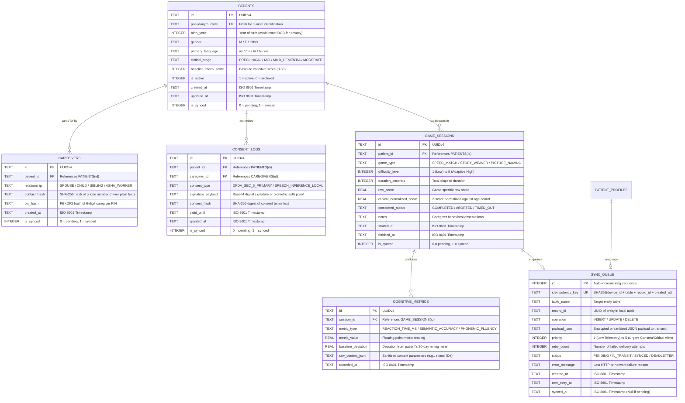

# SmritiSetu (SIH26003) — Database Schema Specification (SQLite / SQLCipher)

## 🗄️ 1. Overview & Encryption Model

SmritiSetu utilizes an encrypted SQLite database via `expo-sqlite` backed by **SQLCipher** (AES-256 in CBC/GCM mode).
* **Target File**: `patient_records.db`
* **Page Size**: 4096 bytes
* **Journal Mode**: Write-Ahead Logging (`WAL`)
* **Integrity Check**: HMAC-SHA512 per page
* **Key Derivation**: PBKDF2 with 100,000 iterations from hardware keystore master key

---

## 🏛️ 2. Entity-Relationship Diagram (Mermaid)



---

## 📜 3. Complete DDL Script with Constraints & Indexes

```sql
-- =============================================================================
-- SMRITISETU (SIH26003) - SQLITE DDL INITIALIZATION SCRIPT
-- Executes upon database creation inside encrypted SQLCipher context
-- =============================================================================

PRAGMA foreign_keys = ON;

-- -----------------------------------------------------------------------------
-- TABLE 1: PATIENTS
-- Stores de-identified patient demographic and clinical baseline data
-- -----------------------------------------------------------------------------
CREATE TABLE IF NOT EXISTS patients (
    id TEXT PRIMARY KEY NOT NULL,                       -- UUIDv4
    pseudonym_code TEXT NOT NULL UNIQUE,                -- E.g. "AS-KAM-2025-0042"
    birth_year INTEGER NOT NULL CHECK (birth_year >= 1900 AND birth_year <= 2010),
    gender TEXT NOT NULL CHECK (gender IN ('M', 'F', 'O')),
    primary_language TEXT NOT NULL CHECK (primary_language IN ('as', 'mn', 'br', 'hi', 'en')),
    clinical_stage TEXT NOT NULL CHECK (clinical_stage IN ('PRECLINICAL', 'MCI', 'MILD_DEMENTIA', 'MODERATE')),
    baseline_moca_score INTEGER DEFAULT NULL CHECK (baseline_moca_score BETWEEN 0 AND 30),
    is_active INTEGER NOT NULL DEFAULT 1 CHECK (is_active IN (0, 1)),
    created_at TEXT NOT NULL DEFAULT (strftime('%Y-%m-%dT%H:%M:%fZ', 'now')),
    updated_at TEXT NOT NULL DEFAULT (strftime('%Y-%m-%dT%H:%M:%fZ', 'now')),
    is_synced INTEGER NOT NULL DEFAULT 0 CHECK (is_synced IN (0, 1))
);

CREATE INDEX IF NOT EXISTS idx_patients_pseudonym ON patients(pseudonym_code);
CREATE INDEX IF NOT EXISTS idx_patients_is_synced ON patients(is_synced);

-- -----------------------------------------------------------------------------
-- TABLE 2: CAREGIVERS
-- Family or community health workers who administer the app
-- -----------------------------------------------------------------------------
CREATE TABLE IF NOT EXISTS caregivers (
    id TEXT PRIMARY KEY NOT NULL,                       -- UUIDv4
    patient_id TEXT NOT NULL,
    relationship TEXT NOT NULL CHECK (relationship IN ('SPOUSE', 'CHILD', 'SIBLING', 'ASHA_WORKER', 'COMMUNITY_VOLUNTEER')),
    contact_hash TEXT NOT NULL,                         -- SHA-256 hash of mobile number
    pin_hash TEXT NOT NULL,                             -- PBKDF2 hash of 6-digit caregiver PIN
    created_at TEXT NOT NULL DEFAULT (strftime('%Y-%m-%dT%H:%M:%fZ', 'now')),
    is_synced INTEGER NOT NULL DEFAULT 0 CHECK (is_synced IN (0, 1)),
    FOREIGN KEY (patient_id) REFERENCES patients(id) ON DELETE CASCADE
);

CREATE INDEX IF NOT EXISTS idx_caregivers_patient_id ON caregivers(patient_id);

-- -----------------------------------------------------------------------------
-- TABLE 3: CONSENT_LOGS (DPDA 2023 Statutory Requirement)
-- Immutable audit log of proxy consent granted by caregiver
-- -----------------------------------------------------------------------------
CREATE TABLE IF NOT EXISTS consent_logs (
    id TEXT PRIMARY KEY NOT NULL,                       -- UUIDv4
    patient_id TEXT NOT NULL,
    caregiver_id TEXT NOT NULL,
    consent_type TEXT NOT NULL CHECK (consent_type IN ('DPDA_SEC_6_PRIMARY', 'SPEECH_INFERENCE_LOCAL', 'RESEARCH_TELEMETRY')),
    signature_payload TEXT NOT NULL,                    -- Base64 encoded signature vector
    consent_hash TEXT NOT NULL,                         -- SHA-256 hash of consent terms displayed
    valid_until TEXT NOT NULL,                          -- ISO 8601 expiry timestamp
    granted_at TEXT NOT NULL DEFAULT (strftime('%Y-%m-%dT%H:%M:%fZ', 'now')),
    is_synced INTEGER NOT NULL DEFAULT 0 CHECK (is_synced IN (0, 1)),
    FOREIGN KEY (patient_id) REFERENCES patients(id) ON DELETE RESTRICT,
    FOREIGN KEY (caregiver_id) REFERENCES caregivers(id) ON DELETE RESTRICT
);

CREATE INDEX IF NOT EXISTS idx_consent_patient_id ON consent_logs(patient_id);

-- -----------------------------------------------------------------------------
-- TABLE 4: GAME_SESSIONS
-- High-level game run outcomes for cognitive therapy
-- -----------------------------------------------------------------------------
CREATE TABLE IF NOT EXISTS game_sessions (
    id TEXT PRIMARY KEY NOT NULL,                       -- UUIDv4
    patient_id TEXT NOT NULL,
    game_type TEXT NOT NULL CHECK (game_type IN ('SPEED_MATCH', 'STORY_WEAVER', 'PICTURE_NAMING')),
    difficulty_level INTEGER NOT NULL CHECK (difficulty_level BETWEEN 1 AND 5),
    duration_seconds INTEGER NOT NULL CHECK (duration_seconds >= 0),
    raw_score REAL NOT NULL,
    clinical_normalized_score REAL NOT NULL,            -- Age & education adjusted standard score
    completed_status TEXT NOT NULL CHECK (completed_status IN ('COMPLETED', 'ABORTED', 'TIMED_OUT')),
    notes TEXT DEFAULT NULL,
    started_at TEXT NOT NULL,
    finished_at TEXT NOT NULL DEFAULT (strftime('%Y-%m-%dT%H:%M:%fZ', 'now')),
    is_synced INTEGER NOT NULL DEFAULT 0 CHECK (is_synced IN (0, 1)),
    FOREIGN KEY (patient_id) REFERENCES patients(id) ON DELETE CASCADE
);

CREATE INDEX IF NOT EXISTS idx_game_sessions_patient ON game_sessions(patient_id, game_type);
CREATE INDEX IF NOT EXISTS idx_game_sessions_finished_at ON game_sessions(finished_at);
CREATE INDEX IF NOT EXISTS idx_game_sessions_is_synced ON game_sessions(is_synced);

-- -----------------------------------------------------------------------------
-- TABLE 5: COGNITIVE_METRICS
-- Granular round-level measurements (Reaction times, phonemic fluency, errors)
-- -----------------------------------------------------------------------------
CREATE TABLE IF NOT EXISTS cognitive_metrics (
    id TEXT PRIMARY KEY NOT NULL,                       -- UUIDv4
    session_id TEXT NOT NULL,
    metric_type TEXT NOT NULL CHECK (metric_type IN ('REACTION_TIME_MS', 'SEMANTIC_ACCURACY', 'PHONEMIC_FLUENCY', 'ERROR_COUNT')),
    metric_value REAL NOT NULL,
    baseline_deviation REAL DEFAULT 0.0,                -- Standard deviation from 30-day baseline
    raw_context_json TEXT DEFAULT NULL,                 -- Stimulus identifiers, e.g. {"target": "RHINO"}
    recorded_at TEXT NOT NULL DEFAULT (strftime('%Y-%m-%dT%H:%M:%fZ', 'now')),
    FOREIGN KEY (session_id) REFERENCES game_sessions(id) ON DELETE CASCADE
);

CREATE INDEX IF NOT EXISTS idx_metrics_session_id ON cognitive_metrics(session_id);
CREATE INDEX IF NOT EXISTS idx_metrics_type_recorded ON cognitive_metrics(metric_type, recorded_at);

-- -----------------------------------------------------------------------------
-- TABLE 6: SYNC_QUEUE
-- Durable, idempotent queue for background synchronization to FastAPI backend
-- -----------------------------------------------------------------------------
CREATE TABLE IF NOT EXISTS sync_queue (
    id INTEGER PRIMARY KEY AUTOINCREMENT,
    idempotency_key TEXT NOT NULL UNIQUE,               -- SHA-256 unique signature
    table_name TEXT NOT NULL,                           -- e.g. "game_sessions"
    record_id TEXT NOT NULL,                            -- Target UUID
    operation TEXT NOT NULL CHECK (operation IN ('INSERT', 'UPDATE', 'DELETE')),
    payload_json TEXT NOT NULL,                         -- Sanitized JSON data payload
    priority INTEGER NOT NULL DEFAULT 1 CHECK (priority BETWEEN 1 AND 5),
    retry_count INTEGER NOT NULL DEFAULT 0,
    status TEXT NOT NULL DEFAULT 'PENDING' CHECK (status IN ('PENDING', 'IN_TRANSIT', 'SYNCED', 'DEADLETTER')),
    error_message TEXT DEFAULT NULL,
    created_at TEXT NOT NULL DEFAULT (strftime('%Y-%m-%dT%H:%M:%fZ', 'now')),
    next_retry_at TEXT NOT NULL DEFAULT (strftime('%Y-%m-%dT%H:%M:%fZ', 'now')),
    synced_at TEXT DEFAULT NULL
);

CREATE INDEX IF NOT EXISTS idx_sync_queue_status_priority ON sync_queue(status, priority DESC, next_retry_at);
```

---

## 📶 4. OFFLINE BEHAVIOR SPECIFICATION (Database Subsystem)

### 1. What happens when this feature runs with zero internet connectivity?
* All DDL queries, index lookups, inserts, and updates execute completely locally inside `patient_records.db`.
* Database latency is under 4 milliseconds for standard inserts and under 15 milliseconds for 30-day analytical trend calculations.
* Zero remote socket calls are made during any database read or write operation.

### 2. What data is stored locally vs. requires cloud?
* **Locally Stored**: 100% of the relational schema defined above.
* **Requires Cloud**: No data strictly requires the cloud for the app to function indefinitely. The cloud simply aggregates `payload_json` from `sync_queue` when network is present.

### 3. What is the fallback/degradation strategy if cloud is unreachable?
* Rows written to `sync_queue` remain in status `'PENDING'`. The local app continues reading directly from `patients`, `game_sessions`, and `cognitive_metrics`.
* Caregivers can view historical progress charts for years without ever connecting to the internet.

### 4. How does the user know they're in offline mode? (UI indicators)
* Querying `SELECT COUNT(*) FROM sync_queue WHERE status = 'PENDING'` provides the count of records safely queued locally.
* The UI displays: *"১০ টা খেল সংৰক্ষিত হৈছে (10 sessions saved locally)"*.

### 5. How does data integrity survive app crashes during offline operation?
* Full ACID compliance via SQLite Write-Ahead Logging (`WAL`).
* Every batch insert into `game_sessions` and `sync_queue` occurs inside an atomic transaction:
  ```sql
  BEGIN TRANSACTION;
  INSERT INTO game_sessions (...) VALUES (...);
  INSERT INTO sync_queue (...) VALUES (...);
  COMMIT;
  ```
* Power loss at any millisecond before `COMMIT` guarantees zero partial corrupt state.
