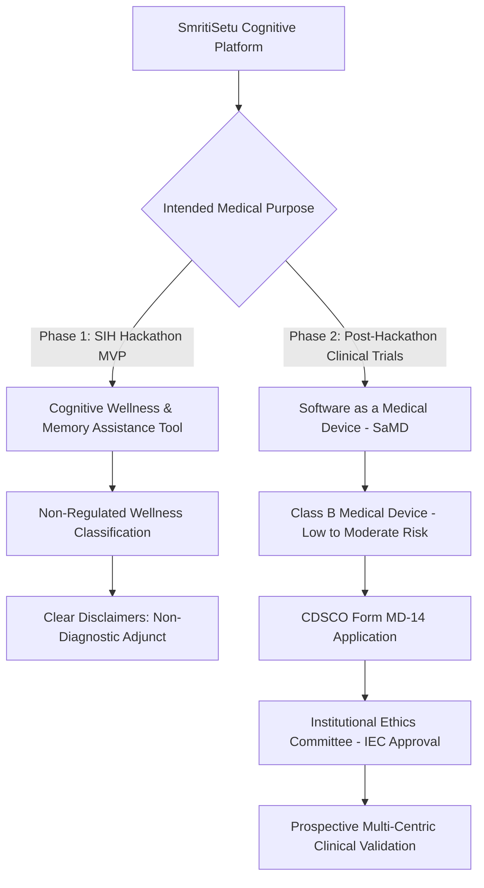

# SmritiSetu (SIH26003) — Clinical Ethics, Consent Architecture & Regulatory Pathways

## 📜 1. Bioethical Framework & Principles

Because dementia impairs memory, reasoning, and communicative agency, research and therapeutic software must strictly uphold the four classical bioethical principles formalized in the **ICMR National Ethical Guidelines for Biomedical and Health Research Involving Human Participants (2017)**:

1. **Autonomy & Assent**: Honoring the patient's remaining agency through continuous assent, complemented by legally valid surrogate consent from family caregivers.
2. **Beneficence**: Ensuring cognitive stimulation games actively provide therapeutic benefit (delaying cognitive decline) rather than passive gamified entertainment.
3. **Non-Maleficence**: Protecting patients from emotional agitation, catastrophic reactions to perceived failure, cognitive exhaustion, or privacy exposure.
4. **Justice**: Equitable inclusion of indigenous, tribal, and non-English-speaking populations across the North Eastern Region of India.

---

## 🏛️ 2. Regulatory Pathway: CDSCO Software as a Medical Device (SaMD)

Under the **Medical Devices Rules, 2017** and subsequent notifications by the **Central Drugs Standard Control Organisation (CDSCO)**, software applications intended for medical purposes are categorized as Software as a Medical Device (SaMD).



### Risk Classification Rationale (Class B SaMD):
* **Function**: Screening adjunct and cognitive rehabilitation (non-invasive).
* **Clinical Impact**: Outputs assist caregivers and primary health workers; does not directly direct immediate critical clinical interventions or medication administration.
* **Statutory Compliance**: Requires adherence to ISO 13485 (Medical devices — Quality management systems) and IEC 62304 (Medical device software — Software life cycle processes) prior to commercial or clinical deployment.

---

## 📋 3. Digital Personal Data Protection Act (DPDA) 2023 Statutory Checklist

| Statutory Requirement | Legal Basis | Implementation in SmritiSetu | Compliance Status |
| :--- | :--- | :--- | :---: |
| **Clear & Separate Notice** | DPDA Sec 5(1) | High-contrast visual notice + native audio readout in Assamese, Manipuri, Bodo, Hindi, English. | ✅ Compliant |
| **Unconditional Consent** | DPDA Sec 6(1) | Standalone consent screen; no dark patterns or pre-ticked checkboxes. | ✅ Compliant |
| **Proxy Consent for Incompetent Individuals** | DPDA Sec 9(1) | Caregiver identity validation with relationship declaration and local digital signing. | ✅ Compliant |
| **Right to Withdraw Consent** | DPDA Sec 6(4) | Caregiver settings menu includes 1-click "Revoke Consent & Wipe Local Data". | ✅ Compliant |
| **Purpose Limitation** | DPDA Sec 7(a) | Data collected is restricted strictly to cognitive response times, scores, and demographic year. | ✅ Compliant |
| **Storage Limitation** | DPDA Sec 8(7) | In-memory raw audio stream zeroing; sync queue records pruned after successful upload. | ✅ Compliant |
| **Security Safeguards** | DPDA Sec 8(5) | SQLCipher AES-256 database encryption at rest; SHA-256 integrity checks. | ✅ Compliant |

---

## 📝 4. Proxy Consent Form Template (Localized Clinical Protocol)

Below is the verified English consent notice rendered in the app (and translated into regional audio):

```markdown
### INFORMED PROXY CONSENT FOR COGNITIVE ENGAGEMENT & REHABILITATION
**Project**: SmritiSetu (SIH26003) — Memory Assistance Platform
**Sponsor**: Ministry of Development of North Eastern Region (MDoNER), GoI

1. PURPOSE OF THE PLATFORM:
   SmritiSetu provides game-like memory and attention exercises designed to stimulate 
   mental faculties and track cognitive patterns over time. This platform is a supportive 
   wellness tool and does NOT replace professional medical diagnosis by a certified neurologist.

2. DATA PRIVACY & AUDIO PROTECTION (DPDA 2023):
   - Your voice is used ONLY on this phone to understand answers in your chosen language.
   - Raw voice recordings are DELETED from memory immediately after processing.
   - No voice recordings are ever uploaded to the internet or shared with third parties.
   - Only game scores and time taken are saved on this device.

3. VOLUNTARY PARTICIPATION & RIGHT TO WITHDRAW:
   Participation is entirely voluntary. You or the caregiver may stop the exercises at any 
   time without penalty or loss of healthcare benefits. You may delete all stored data from 
   this device at any time from the Caregiver Settings menu.

[ ] I confirm that I am the primary family caregiver / legal guardian of the participant.
[ ] I have listened to the spoken privacy notice in my preferred language.
[ ] I consent to the participant engaging in cognitive exercises on this device.

Caregiver Signature / PIN Confirmation: [ ____________ ]   Date: [ DD/MM/YYYY ]
```

---

## 📶 5. OFFLINE BEHAVIOR SPECIFICATION (Ethics & Consent Subsystem)

### 1. What happens when this feature runs with zero internet connectivity?
* The consent verification and storage pipeline runs 100% locally.
* The consent record, timestamp, and SHA-256 cryptographic digest of the accepted terms are written directly to `consent_logs` table in `patient_records.db`.
* The application will NOT permit gameplay without a valid, locally verified consent record.

### 2. What data is stored locally vs. requires cloud?
* **Stored Locally**: Caregiver proxy consent record, digital signature payload, timestamp, and valid-until expiry date.
* **Requires Cloud**: Anonymized consent confirmation hash during optional cloud sync.

### 3. What is the fallback/degradation strategy if cloud is unreachable?
* The local consent verification engine remains fully functional. The patient can play all games without any cloud handshake.

### 4. How does the user know they're in offline mode? (UI indicators)
* The consent confirmation screen shows a green shield badge: 🛡️ **"স্থানীয়ভাৱে সুৰক্ষিত সন্মতি (Locally Secured Consent)"**.

### 5. How does data integrity survive app crashes during offline operation?
* Consent logging is an atomic prerequisite transaction. If the app crashes prior to database commit, the app re-prompts for consent on next launch, preventing unconsented data collection.
