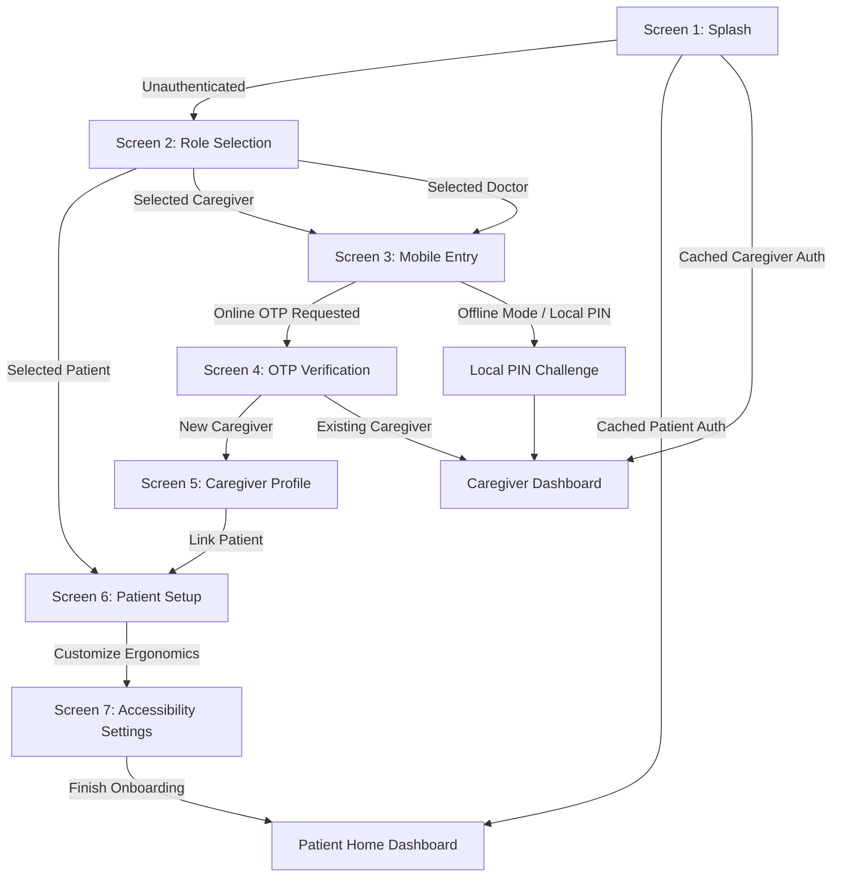

# SmritiSetu (SIH26003) — Navigation Architecture & Screen State Routing

## 🗺️ 1. Master Navigation Graph

The navigation structure utilizes **React Navigation v6** (`@react-navigation/native-stack`), separating unauthenticated onboarding flows from authenticated therapeutic loops while supporting emergency offline state transitions.



---

## 🧱 2. Root Navigator Implementation (`mobile-app/src/navigation/RootNavigator.tsx`)

```tsx
import React from 'react';
import { createNativeStackNavigator } from '@react-navigation/native-stack';
import { NavigationContainer } from '@react-navigation/native';

// Screen Imports
import SplashScreen from '@/screens/auth/SplashScreen';
import RoleSelectionScreen from '@/screens/auth/RoleSelectionScreen';
import MobileEntryScreen from '@/screens/auth/MobileEntryScreen';
import OTPVerificationScreen from '@/screens/auth/OTPVerificationScreen';
import CaregiverProfileScreen from '@/screens/auth/CaregiverProfileScreen';
import PatientSetupScreen from '@/screens/auth/PatientSetupScreen';
import AccessibilityScreen from '@/screens/settings/AccessibilityScreen';

export type RootStackParamList = {
  Splash: undefined;
  RoleSelection: { source?: 'splash' | 'logout' };
  MobileEntry: { role: 'CAREGIVER' | 'DOCTOR' };
  OTPVerification: { role: 'CAREGIVER' | 'DOCTOR'; phoneNumber: string; isOfflineFallback?: boolean };
  CaregiverProfile: { phoneNumber: string; role: 'CAREGIVER' | 'DOCTOR' };
  PatientSetup: { caregiverId?: string; isNew?: boolean };
  AccessibilityScreen: { patientId?: string; isInitialOnboarding?: boolean };
  PatientHome: { patientId?: string };
  CaregiverDashboard: { caregiverId?: string };
};

const Stack = createNativeStackNavigator<RootStackParamList>();

export const RootNavigator = () => {
  return (
    <NavigationContainer
      linking={{
        prefixes: ['sih26003://', 'https://smritisetu.doner.gov.in'],
        config: {
          screens: {
            Splash: 'splash',
            RoleSelection: 'auth/role',
            MobileEntry: 'auth/login',
            OTPVerification: 'auth/verify',
            CaregiverProfile: 'auth/caregiver-setup',
            PatientSetup: 'auth/patient-setup',
            AccessibilityScreen: 'settings/accessibility',
          },
        },
      }}
    >
      <Stack.Navigator
        initialRouteName="Splash"
        screenOptions={{
          headerShown: false,
          animation: 'fade', // Gentle cross-fade avoids rapid slide triggers that disorient elderly
          contentStyle: { backgroundColor: '#121212' },
        }}
      >
        {/* Onboarding & Authentication Stack */}
        <Stack.Group>
          <Stack.Screen name="Splash" component={SplashScreen} />
          <Stack.Screen name="RoleSelection" component={RoleSelectionScreen} />
          <Stack.Screen name="MobileEntry" component={MobileEntryScreen} />
          <Stack.Screen name="OTPVerification" component={OTPVerificationScreen} />
          <Stack.Screen name="CaregiverProfile" component={CaregiverProfileScreen} />
          <Stack.Screen name="PatientSetup" component={PatientSetupScreen} />
          <Stack.Screen name="AccessibilityScreen" component={AccessibilityScreen} />
        </Stack.Group>
      </Stack.Navigator>
    </NavigationContainer>
  );
};
```

---

## 🧭 3. Navigation Decisions & Elderly Considerations

1. **Stack vs Tab vs Drawer**:
   * Drawer navigation is **strictly forbidden**: Dementia patients cannot conceptualize off-screen slide-out shelves and get lost when drawers collapse.
   * Authentication uses a strict linear Stack where forward actions use `navigation.replace()` on terminal steps to prevent back-button trap loops.
2. **Animation Decisions**:
   * Uses gentle cross-fade (`animation: 'fade'`) with $300\text{ms}$ duration. No spring or bouncy dynamics.
3. **Hardware Android Back Button Policy**:
   * Tapping Android physical back button on `Splash` or `RoleSelection` prompts a high-contrast exit modal with spoken audio confirmation rather than abrupt app death.
