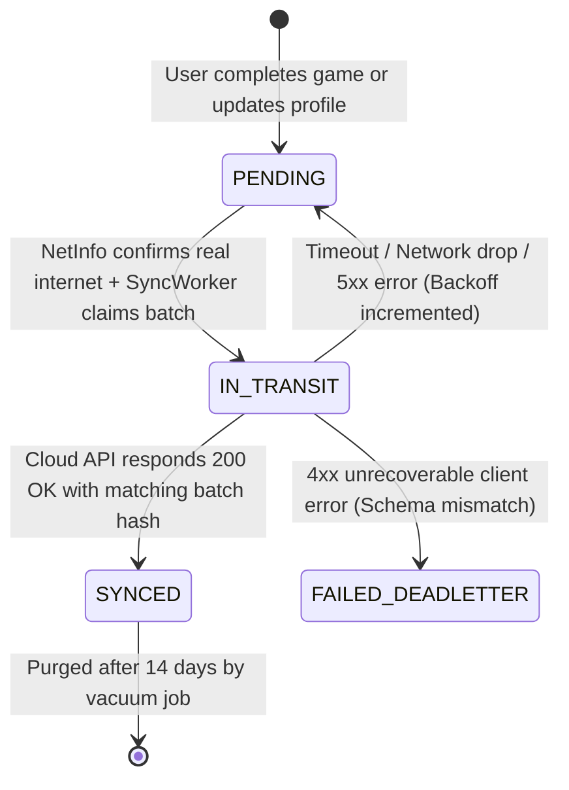

# SmritiSetu (SIH26003) — Offline-First Technical Strategy & Synchronization Protocol

## 🌐 1. Theoretical Foundation: Local-First Healthcare

In high-resource urban healthcare, mobile apps function as thin clients over REST/GraphQL interfaces. In the rural North Eastern Region of India, telecommunications connectivity is characterized by:
* High packet loss (> 25% on 2G/EDGE networks in hill states)
* Severe latency spikes (500ms to 4000ms)
* Prolonged complete network blackouts lasting days or weeks during seasonal monsoons

Therefore, SmritiSetu treats the edge device as the **authoritative master system of record**. All user commands write directly to local SQLite. The cloud is a passive secondary subscriber.

---

## 📊 2. Comprehensive Offline Capability Matrix

| Subsystem / Operation | Offline Capability | Local Storage Footprint | Network Requirement | Failover / Fallback Behavior |
| :--- | :---: | :--- | :--- | :--- |
| **Elderly PIN / Biometric Auth** | 100% | ~4 KB (PBKDF2 Hash) | None | Authenticates against local encrypted keystore. |
| **Speed Match Gameplay** | 100% | ~2.5 MB (Vector Icons) | None | Complete game loop, timer, and score calculation run locally. |
| **Story Weaver ASR Inference** | 100% | ~38 MB (ONNX Model) | None | INT8 quantized IndicConformer model infers directly in memory. |
| **Picture Naming Task** | 100% | ~4.8 MB (Images + Audio)| None | Bundled high-contrast cultural illustrations and local voice prompts. |
| **Longitudinal Trend Analytics**| 100% | ~500 KB (SQL Views) | None | 30-day rolling average and cognitive slope calculated in SQLite. |
| **Caregiver Emergency Alert** | 100% (Local) | ~10 KB | None (Local Audio/Push)| Dispatches OS AlarmManager high-priority alert on caregiver phone. |
| **Batch Cloud Synchronization** | Deferred | Dynamic (`sync_queue`) | WiFi or 3G/4G/5G | Batches accumulate in SQLite; synced automatically when online. |
| **AI Model Upgrades** | Paused | N/A | High-speed Wi-Fi only | Retains bundled base model until verified differential model patch is downloaded. |

---

## ⚡ 3. The 5 Mission-Critical Offline Edge Cases & Handlers

### Edge Case 1: State Conflict Resolution (Two Devices Updating Same Patient)
* **Scenario**: A patient is assessed on a community health worker's (ASHA) tablet in the field while a family caregiver simultaneously updates patient preferences on a home smartphone. Both devices were offline; both sync when returning to town.
* **Resolution Strategy**: **Vector Clocks + Domain-Specific Semantic Merge Rules**.
  * *Game Assessment Records*: Append-only. Since every game session has a globally unique `UUIDv4` generated at session start, conflicts in clinical records are impossible; both sessions are preserved.
  * *Patient Demographic / Clinical Settings*: **Caregiver-Priority Last-Write-Wins (LWW)** with Lamport Timestamps. If timestamps collide within a 5-second window, Caregiver profile modifications override community health worker defaults.
  * *Ties*: Resolved deterministically by comparing lexical ordering of the UUIDs.

### Edge Case 2: Sync Queue Overflow (Prolonged 30+ Day Offline Period)
* **Scenario**: A patient lives in an isolated village in Mon district (Nagaland) with zero mobile network for 45 consecutive days. Daily game sessions generate hundreds of records.
* **Resolution Strategy**: **Tiered Queue Pruning & Local Aggregation**.
  1. `sync_queue` table has a hard capacity ceiling of **5,000 entries** (~1.2 MB disk space).
  2. If the queue reaches 80% capacity (4,000 entries), an automatic internal SQLite rollover job triggers:
     * High-granularity raw per-round latency taps (e.g., individual reaction times for 100 rounds of Speed Match) are aggregated into statistical summaries: `mean_rt`, `std_dev_rt`, `min_rt`, `max_rt`, `error_rate`.
     * The raw round-level queue rows are deleted, and a single consolidated session summary row is inserted.
     * The patient's clinical baseline remains 100% intact with zero loss of clinical validity.

### Edge Case 3: Storage Limit Exhaustion on Low-End Hardware
* **Scenario**: The patient's device is an entry-level Android phone with only 16GB internal storage, and internal flash memory drops below 100MB free space.
* **Resolution Strategy**: **Aggressive LRU Cache Eviction & Audio Guard**.
  1. SmritiSetu strictly enforces **Zero Audio File Footprint**; raw audio is NEVER written to flash storage.
  2. If OS dispatches `onLowMemory()` or `FileSystem.getFreeDiskStorageAsync()` drops below 150MB:
     * Prune synced logs from `sync_queue` where `status = 'SYNCED'` and `synced_at < NOW() - INTERVAL 14 DAYS`.
     * Execute `PRAGMA incremental_vacuum(500);` to reclaim unallocated database pages.
     * Delete temporary UI render caches and downscaled image buffers.
     * Core clinical SQLite records (`patient_records.db`) are pinned as non-evictable.

### Edge Case 4: Differential Model Updates over Intermittent Connections
* **Scenario**: A new fine-tuned IndicConformer model (reducing Word Error Rate for Bodo language) is published, but the user is on an intermittent 2G connection that repeatedly disconnects.
* **Resolution Strategy**: **Chunked Resumable Downloads with Cryptographic Verification**.
  1. Model updates are restricted to **unmetered Wi-Fi connections** by default (can be overridden by caregiver).
  2. Model files are downloaded in **512KB binary chunks** using HTTP Range requests (`bytes=start-end`).
  3. Download progress is tracked in an internal SQLite table `model_download_chunks`.
  4. Once 100% of chunks are retrieved, the device validates the complete file against an SHA-256 checksum embedded in the server manifest.
  5. The new model is loaded into a staging directory. ONNX Runtime attempts a test inference pass on a stub tensor. Only upon success does the app atomically swap the active model pointer. If the test fails, the previous model is retained.

### Edge Case 5: Partial / Flapping Connectivity ("Captive Portal / 2G Ghost Connection")
* **Scenario**: The device connects to a public Wi-Fi access point that requires captive portal login, or is connected to a 2G cellular tower with 100% packet drop. The OS reports `isConnected = true`, but no internet traffic passes.
* **Resolution Strategy**: **Three-Tier Connectivity Verification Protocol**.
  1. `NetInfo` hook detects basic link-layer status (`isConnected` and `isInternetReachable`).
  2. Before dispatching a sync batch from `sync_queue`, the sync worker performs an active **Health Ping** (`HEAD /api/v1/health` with a 3000ms timeout).
  3. If the health ping times out or returns non-200, the connection is classified as `GHOST_CONNECTION`.
  4. The sync worker immediately suspends sync operations, enters exponential backoff (e.g., 30s, 60s, 120s up to a max of 15 minutes), and avoids draining device battery through fruitless HTTP connection attempts.

---

## 🔄 4. The Sync Queue Schema & State Machine



### Sync State Rules
1. **Idempotency**: Every outbound sync item includes an `idempotency_key` constructed as `SHA256(device_id + table_name + local_record_id + created_at)`.
2. **At-Least-Once Delivery**: The client guarantees all records reach the cloud; the cloud gateway guarantees deduplication based on the idempotency key.
3. **Batch Sizing**: Records are batched in groups of **25 items** to prevent HTTP request body timeouts on slow connections.

---

## 📶 5. OFFLINE BEHAVIOR SPECIFICATION (Offline-First Strategy)

### 1. What happens when this feature runs with zero internet connectivity?
* All game engines, audio recording, ASR transcriptions, scoring algorithms, and caregiver dashboards execute with 100% parity to online execution.
* Sync workers remain dormant; zero CPU cycles are wasted attempting socket connections.

### 2. What data is stored locally vs. requires cloud?
* **Locally Stored**: Complete patient profile, game history, raw reaction times, semantic accuracy scores, caregiver notes, consent timestamps, ONNX neural models, and cultural multimedia.
* **Requires Cloud**: Cross-regional population analytics, federated model weight updates, remote doctor tele-consultation exports.

### 3. What is the fallback/degradation strategy if cloud is unreachable?
* Infinite local buffering inside the encrypted SQLite database. No data is lost or dropped.

### 4. How does the user know they're in offline mode? (UI indicators)
* A high-contrast status badge in the header:
  * 📴 **"অফলাইন ম'ড (Offline Mode)"**
  * Subtext: *"আপোনাৰ সকলো তথ্য সুৰক্ষিতভাৱে সংৰক্ষিত হৈছে (All data safely saved locally)"*.

### 5. How does data integrity survive app crashes during offline operation?
* Every game session write is executed in an atomic transaction:
  ```typescript
  await db.withTransactionAsync(async () => {
    await db.runAsync('INSERT INTO game_sessions ...');
    await db.runAsync('INSERT INTO cognitive_metrics ...');
    await db.runAsync('INSERT INTO sync_queue ...');
  });
  ```
* If the app crashes or the battery dies during execution, either all three tables are committed or none are. On next launch, SQLite detects the clean state.
