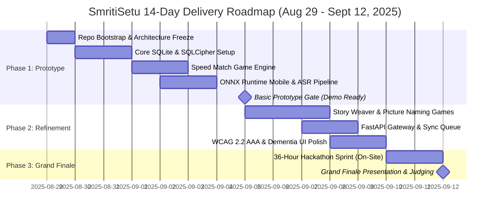

# SmritiSetu (SIH26003) — Project Timeline, Roadmaps & Hackathon Sprint Plan

## 📅 1. Master Timeline Overview

* **Today's Date**: August 29, 2025 (Repository Initialization & Architecture Freeze)
* **Milestone 1: Basic Working Prototype Deadline**: September 5, 2025 (T - 7 Days)
* **Milestone 2: Final Hackathon Presentation & Grand Finale**: September 10–12, 2025 (T - 14 Days)

---

## 🗓️ 2. Phase 1: Prototype Development Plan (Aug 29 – Sept 5, 2025)

| Date | Key Engineering Deliverables | Primary Owner | Verification Criterion |
| :--- | :--- | :--- | :--- |
| **Day 1 (Aug 29)** | Repo scaffold, GitHub Org setup, branch rules, `.env`, Docker stack. | Lead Architect | `docker compose up` & `npm start` pass. |
| **Day 2 (Aug 30)** | SQLite schema implementation, SQLCipher keys, Redux store wiring. | Mobile Core | SQLite CRUD operations pass in Jest tests. |
| **Day 3 (Aug 31)** | High-contrast WCAG 2.2 AAA theme, layout engine, audio player hook. | Clinical UX | Color contrast verified > 7:1; audio plays. |
| **Day 4 (Sept 1)** | Speed Match game loop, adaptive difficulty timer, scoring formula. | Mobile Games | Game runs at 60 FPS on Android device. |
| **Day 5 (Sept 2)** | ONNX Runtime Mobile integration, INT8 IndicConformer stub model load. | AI/ML Edge | Sub-400ms inference on test PCM tensor. |
| **Day 6 (Sept 3)** | Audio recording via `expo-av`, in-memory buffer, zero-disk audio delete. | AI/ML + Mobile | Memory profile verifies buffer zeroed. |
| **Day 7 (Sept 4)** | Caregiver dashboard, local 30-day trend chart, consent proxy flow. | Mobile Core | End-to-end user loop functional offline. |
| **Day 8 (Sept 5)** | **PROTOTYPE GATE**: Standalone offline APK build, demo video recording. | All 6 Members | **Offline APK runs in Airplane Mode without errors.** |

---

## 🚀 3. Phase 2: Feature Expansion & Hardening (Sept 6 – Sept 9, 2025)

* **Sept 6**: Implement **Story Weaver** game loop and Assamese/Manipuri narrative curricula.
* **Sept 7**: Implement **Picture Naming** game with NER cultural illustrations (Rhino, Japi, Dokhona).
* **Sept 8**: Build `sync_queue` background worker, backoff exponential retry, and FastAPI sync receiver.
* **Sept 9**: Comprehensive offline edge-case testing (airplane mode toggling, low memory simulation, battery kill).

---

## ⚡ 4. Phase 3: Grand Finale 36-Hour Sprint (Sept 10 – Sept 12, 2025)

### Day 1: Wednesday, September 10, 2025 (Kickoff & Integration Lock)
* **09:00 - 11:00**: On-site arrival, physical booth setup, team role confirmation.
* **11:00 - 13:00**: Codebase sync, dependency freeze, verification of local test hardware.
* **13:00 - 15:00**: End-to-end integration test of 3 games + ASR + SQLite on 3 physical Android phones.
* **15:00 - 18:00**: Edge case stress testing: 50 consecutive game runs, memory leak profiling with Android Studio Profiler.
* **18:00 - 21:00**: Mentorship Round 1: Pitch presentation to assigned SIH technical mentors; log feedback.
* **21:00 - 24:00**: Triage mentor feedback; adjust scoring visualizations or cultural terminology as advised.

### Day 2: Thursday, September 11, 2025 (Harden, Polish & Judge Preparation)
* **00:00 - 04:00**: Deep Work Sprint: Refactor UI transitions, optimize ONNX memory footprint.
* **04:00 - 08:00**: Mandatory sleep shift (Team splits into 3-hour staggered rest cycles).
* **08:00 - 11:00**: Mentorship Round 2: Pitch presentation to clinical & MDoNER ministry evaluators.
* **11:00 - 14:00**: Hardening the "Airplane Mode" live demo script; pre-populating realistic 30-day patient profiles.
* **14:00 - 18:00**: Final production release build (`smritisetu-release-v1.0.0.apk`) generated and signed.
* **18:00 - 21:00**: Slide deck finalization, judge Q&A rehearsal, backup device verification.
* **21:00 - 24:00**: Rehearsal: Complete 5-minute timed presentation with live speech demo in Assamese.

### Day 3: Friday, September 12, 2025 (The Grand Finale & Presentation)
* **00:00 - 06:00**: Final bug lock (Zero new features permitted). Complete sleep and mental rest.
* **06:00 - 08:00**: Final device battery checks (all test phones charged to 100%, offline mode active).
* **08:00 - 12:00**: Grand Jury Evaluation: Live demonstration in front of Ministry of DoNER panel.
* **12:00 - 15:00**: Public & Peer Showcase.
* **15:00 - 18:00**: Valedictory ceremony & Smart India Hackathon awards announcement.

---

## 📶 5. OFFLINE BEHAVIOR SPECIFICATION (Timeline & Delivery Strategy)

### 1. What happens when demo runs with zero internet connectivity?
* The judging presentation is explicitly structured to begin by **placing the demonstration smartphone into Airplane Mode in front of the judges**.
* All features—speech recognition in Assamese, games, and analytics—run in front of the judges with zero connectivity.

### 2. What data is stored locally vs. requires cloud?
* All demo data (sample patients, 30 days of pre-recorded clinical trends, audio prompts, games) is bundled directly inside the local SQLite database.

### 3. What is the fallback/degradation strategy if demo device hardware fails?
* 3 identical physical Android test devices are maintained with identical pre-loaded databases. If Phone A exhibits hardware fault, Phone B is swapped in under 10 seconds.

### 4. How does the user know they're in offline mode? (UI indicators)
* Top bar clearly shows 📴 **"অফলাইন ম'ড (Offline Mode)"**, visually confirming to judges that zero data packets are leaving the device.

### 5. How does data integrity survive app crashes during offline operation?
* SQLite WAL mode ensures all demo actions persist cleanly even if an evaluator accidentally closes the app.
